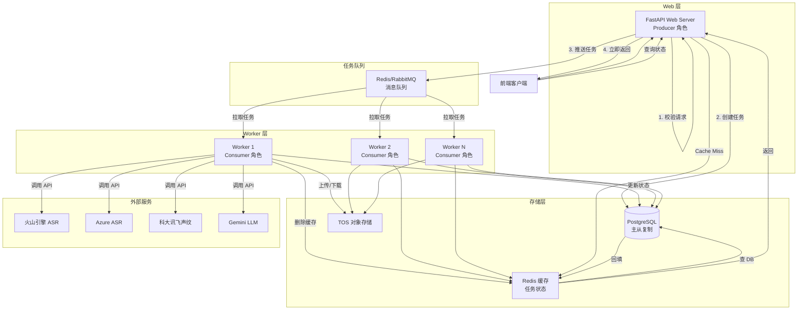
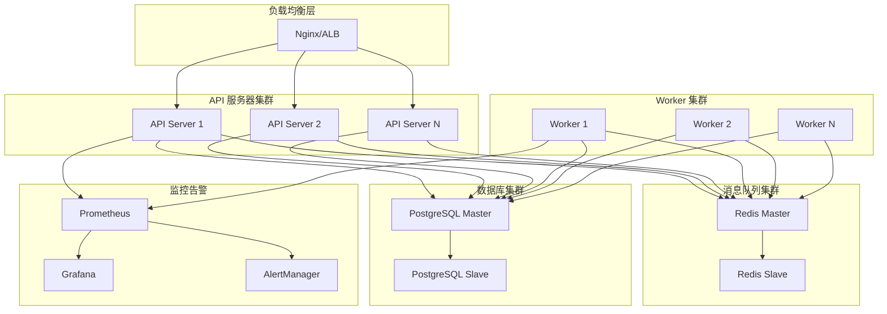

# 设计文档

## 概述

会议纪要 Agent 是一个基于异步任务架构的多模型编排系统,通过 ASR(自动语音识别)、声纹识别和 LLM 摘要处理会议录音,生成带有说话人身份的结构化会议纪要。

系统采用生产者-消费者模式,Web API 作为生产者接收请求并创建任务,Worker 作为消费者从队列拉取任务并执行处理。这种架构确保 API 不被长时间运行的任务阻塞,支持横向扩展和高并发处理。

### 核心特性

- **异步任务处理**: Web API 立即返回任务 ID,Worker 异步执行处理
- **多模型编排**: 可配置的 Pipeline 支持灵活的模型组合和替换
- **双轨 ASR 策略**: 火山引擎为主,Azure 为备,自动降级
- **声纹识别**: 科大讯飞 1:N 检索,支持分差挽救机制
- **成本控制**: 预估成本、配额管理、熔断机制
- **多租户支持**: 热词库按作用域隔离,API 鉴权与配额绑定
- **数据生命周期**: 音频根据任务状态动态延长保留期,默认 7 天,最长可配置至 90 天;文本结果永久保存

## 架构

### 系统架构图



### 异步架构设计

系统采用 **Producer-Consumer 模式** 实现异步任务处理:

**Producer (Web API)**:
- 职责: 请求验证、任务创建、队列推送
- 不执行: 音频处理、模型调用、重计算
- 响应时间: < 1 秒

**Consumer (Worker)**:
- 职责: 任务拉取、音频拼接、模型调用、结果写入
- 并发: 可横向扩展
- 隔离: 单个 Worker 崩溃不影响其他 Worker

**消息队列**:
- 技术选型: Redis (简单场景) 或 RabbitMQ (复杂场景)
- 持久化: 任务消息持久化防止丢失
- 优先级: 支持任务优先级队列

### 优雅停机机制

Worker 必须实现优雅停机以避免任务中断:

```python
import signal
import sys

class TaskWorker:
    def __init__(self):
        self.running = True
        self.current_task = None
        self.max_shutdown_wait = 300  # 5 分钟
        
        # 注册信号处理
        signal.signal(signal.SIGTERM, self.handle_shutdown)
        signal.signal(signal.SIGINT, self.handle_shutdown)
    
    def handle_shutdown(self, signum, frame):
        """处理停机信号"""
        logger.info("收到停机信号,开始优雅停机...")
        self.running = False
        
        if self.current_task:
            logger.info(f"等待当前任务完成: {self.current_task.task_id}")
            # 等待当前任务完成或超时
            self.wait_for_current_task(timeout=self.max_shutdown_wait)
        
        logger.info("优雅停机完成")
        sys.exit(0)
    
    def run(self):
        """主循环"""
        while self.running:
            # 拉取任务
            task = self.queue.get(timeout=1)
            if task:
                self.current_task = task
                try:
                    self.process_task(task)
                finally:
                    self.current_task = None
```

**停机流程**:
1. 接收 SIGTERM 信号
2. 停止拉取新任务
3. 等待当前任务完成(最多 5 分钟)
4. 如果超时,将任务状态更新为 FAILED
5. 清理资源并退出

### 数据一致性策略

系统使用 **Cache-Aside 模式** 确保数据库和缓存一致性:

**写入流程** (Worker 更新任务状态):
```python
async def update_task_status(task_id: str, new_state: TaskState):
    async with db.transaction():
        # 1. 先写数据库(事实源)
        await db.tasks.update(
            task_id=task_id,
            state=new_state,
            updated_at=datetime.now()
        )
        
        # 2. 删除缓存(强制下次查询走 DB)
        await cache.delete(f"task_status:{task_id}")
```

**读取流程** (API 查询任务状态):
```python
async def get_task_status(task_id: str) -> TaskStatus:
    # 1. 尝试从缓存读取
    cached = await cache.get(f"task_status:{task_id}")
    if cached:
        return TaskStatus.parse_raw(cached)
    
    # 2. Cache Miss,查询数据库
    status = await db.tasks.get_status(task_id)
    
    # 3. 回填缓存(TTL 60 秒)
    await cache.set(
        f"task_status:{task_id}",
        status.json(),
        ex=60
    )
    
    return status
```

**一致性保证**:
- 数据库是唯一的事实源
- 缓存仅用于加速读取
- 写入时删除缓存,避免脏读
- 缓存 TTL 较短(60 秒),即使不一致也会快速修复

**实时状态查询策略**:
- **Phase 1** (当前优先): 实现轮询 + 长轮询(long polling)机制
  - 前端定期轮询 GET /api/v1/tasks/{task_id}/status
  - 支持长轮询: 服务端等待状态变化或超时后返回
  - 优先保证状态可查询与稳定性
- **Phase 2** (可选优化): 实现 SSE 或 WebSocket 以提升实时性
  - Server-Sent Events (SSE): 单向推送状态更新
  - WebSocket: 双向通信,支持更复杂交互
  - 根据实际需求和负载情况决定是否实施

### 事务管理与补偿机制

系统涉及多个外部服务调用,需要明确的事务边界和补偿逻辑:

**事务边界**:
```python
async def process_meeting(task_id: str):
    try:
        # 1. 更新状态为 TRANSCRIBING
        async with db.transaction():
            await update_task_status(task_id, TaskState.TRANSCRIBING)
        
        # 2. 调用 ASR (不可回滚)
        transcript = await asr_service.transcribe(audio_url)
        
        # 3. 保存中间结果
        async with db.transaction():
            await db.tasks.save_transcript(task_id, transcript)
            await update_task_status(task_id, TaskState.IDENTIFYING)
        
        # 4. 调用声纹识别 (不可回滚)
        speaker_map = await voiceprint_service.identify(transcript, audio_url)
        
        # 5. 保存最终结果
        async with db.transaction():
            await db.tasks.save_speaker_map(task_id, speaker_map)
            await update_task_status(task_id, TaskState.SUCCESS)
            
    except Exception as e:
        # 补偿逻辑
        await compensate_failed_task(task_id, e)
```

**补偿机制**:
```python
async def compensate_failed_task(task_id: str, error: Exception):
    """失败任务的补偿逻辑"""
    try:
        # 1. 更新任务状态为 FAILED
        async with db.transaction():
            await update_task_status(task_id, TaskState.FAILED)
            await db.tasks.save_error(task_id, str(error))
        
        # 2. 清理 TOS 中的临时文件
        temp_files = await db.tasks.get_temp_files(task_id)
        for file_key in temp_files:
            await storage.delete(file_key)
        
        # 3. 记录补偿操作到审计日志
        await audit_log.record(
            task_id=task_id,
            action="compensate",
            details={"error": str(error), "cleaned_files": temp_files}
        )
        
    except Exception as comp_error:
        # 补偿失败,记录到错误日志
        logger.error(f"补偿失败: task_id={task_id}, error={comp_error}")
```

### API 鉴权机制

所有 API 端点必须实现鉴权:

```python
from fastapi import Depends, HTTPException, Header
from typing import Optional

async def verify_api_key(
    authorization: Optional[str] = Header(None)
) -> str:
    """验证 API Key"""
    if not authorization:
        raise HTTPException(status_code=401, detail="缺少 Authorization 头")
    
    if not authorization.startswith("Bearer "):
        raise HTTPException(status_code=401, detail="无效的 Authorization 格式")
    
    api_key = authorization[7:]  # 移除 "Bearer " 前缀
    
    # 验证 API Key
    user_info = await auth_service.validate_api_key(api_key)
    if not user_info:
        raise HTTPException(status_code=401, detail="无效的 API Key")
    
    # 检查配额
    quota = await quota_service.get_quota(user_info.user_id)
    if quota.is_exceeded():
        raise HTTPException(status_code=429, detail="配额已超限")
    
    return user_info.user_id

@router.post("/api/v1/tasks")
async def create_task(
    request: CreateTaskRequest,
    user_id: str = Depends(verify_api_key)
):
    """创建任务(需要鉴权)"""
    # user_id 已通过鉴权验证
    task_id = await task_service.create_task(request, user_id)
    return {"task_id": task_id}
```

### 成本预估与异常防护

系统提供成本预估接口,并在外部 API 异常时提供明确反馈:

**成本预估**:
```python
async def estimate_cost(
    audio_duration: float,
    meeting_type: str,
    enable_speaker_recognition: bool = True
) -> EstimateCostResponse:
    """预估任务成本"""
    # ASR 成本 (火山引擎单价)
    asr_cost = audio_duration * 0.00005  # 元/秒
    
    # 声纹识别成本 (假设平均 3 个说话人,每人 5 秒样本)
    voiceprint_cost = 0
    if enable_speaker_recognition:
        avg_speakers = 3
        sample_duration = 5
        voiceprint_cost = avg_speakers * sample_duration * 0.00003  # 元/秒
    
    # LLM 成本 (基于预估 Token 数)
    estimated_tokens = audio_duration * 10  # 假设每秒 10 个 Token
    llm_cost = estimated_tokens * 0.00002  # 元/Token
    
    total_cost = asr_cost + voiceprint_cost + llm_cost
    
    return EstimateCostResponse(
        total_cost=total_cost,
        cost_breakdown={
            "asr": asr_cost,
            "voiceprint": voiceprint_cost,
            "llm": llm_cost
        }
    )
```

**配额异常处理**:
```python
class QuotaExceededError(MeetingAgentError):
    """配额超限错误"""
    def __init__(self, provider: str, quota_type: str):
        super().__init__(
            message=f"{provider} 配额已超限: {quota_type}",
            provider=provider,
            details={"quota_type": quota_type}
        )

async def call_external_api(provider: str, **kwargs):
    """调用外部 API 并处理配额异常"""
    try:
        return await provider.call(**kwargs)
    except Exception as e:
        # 检测是否为配额相关错误
        if "quota" in str(e).lower() or "limit" in str(e).lower():
            raise QuotaExceededError(
                provider=provider.name,
                quota_type="API 调用次数"
            )
        raise
```

### 任务重试与幂等性

系统必须保证任务执行的幂等性,以应对 Worker 崩溃、网络抖动和外部 API 不稳定:

**幂等性实现**:
```python
async def process_pipeline_step(
    task_id: str,
    step_name: str,
    step_func: Callable
) -> Any:
    """执行 Pipeline Step 并保证幂等性"""
    
    # 1. 检查该 Step 是否已成功执行
    step_status = await db.task_steps.get_status(task_id, step_name)
    if step_status == StepState.SUCCESS:
        logger.info(f"Step 已完成,跳过: {task_id}/{step_name}")
        # 返回已保存的结果
        return await db.task_steps.get_result(task_id, step_name)
    
    # 2. 标记 Step 为 RUNNING
    await db.task_steps.update_status(
        task_id=task_id,
        step_name=step_name,
        status=StepState.RUNNING,
        started_at=datetime.now()
    )
    
    try:
        # 3. 执行 Step
        result = await step_func()
        
        # 4. 保存结果(使用 UPSERT 保证幂等)
        await db.task_steps.upsert_result(
            task_id=task_id,
            step_name=step_name,
            status=StepState.SUCCESS,
            result=result,
            completed_at=datetime.now()
        )
        
        return result
        
    except Exception as e:
        # 5. 记录失败
        await db.task_steps.update_status(
            task_id=task_id,
            step_name=step_name,
            status=StepState.FAILED,
            error=str(e),
            failed_at=datetime.now()
        )
        raise
```

**可重入性分类**:
- **可重入 Step**: ASR 转写、声纹识别、LLM 摘要(相同输入产生相同输出)
- **一次性副作用 Step**: TOS 上传(需要检查文件是否已存在)、计费(需要检查是否已计费)

**消息队列语义**:
- 使用 **at-least-once** 语义(消息可能被多次投递)
- 通过幂等性实现逻辑上的 **exactly-once** 语义

**重新生成计费说明**:
- 重新生成操作(regenerate API)视为独立的 LLM 调用,正常计费
- 系统应当在前端预估中体现重新生成的成本
- 每次重新生成都会创建新版本的 GeneratedArtifact,并记录实际成本

### Redis 与数据库一致性策略(详细版)

系统采用 **混合策略** 平衡性能和一致性:

**数据分类**:
1. **高频变化状态** (仅 Redis): 
   - 当前处理阶段 (TRANSCRIBING, IDENTIFYING, etc.)
   - 进度百分比
   - 预计剩余时间

2. **关键状态** (Redis + DB):
   - 任务创建 (PENDING)
   - 任务完成 (SUCCESS)
   - 任务失败 (FAILED)
   - 部分成功 (PARTIAL_SUCCESS)

3. **持久化数据** (仅 DB):
   - 转写结果
   - 说话人映射
   - 会议纪要
   - 审计日志

**更新策略**:
```python
async def update_task_progress(task_id: str, stage: str, progress: float):
    """更新任务进度(仅 Redis)"""
    await redis.hset(
        f"task:{task_id}",
        mapping={
            "stage": stage,
            "progress": progress,
            "updated_at": datetime.now().isoformat()
        },
        ex=3600  # 1 小时过期
    )

async def update_task_final_status(
    task_id: str,
    status: TaskState,
    result: Optional[dict] = None
):
    """更新任务最终状态(Redis + DB)"""
    # 1. 先更新 Redis(快速响应前端)
    await redis.hset(
        f"task:{task_id}",
        mapping={
            "status": status.value,
            "updated_at": datetime.now().isoformat()
        }
    )
    
    # 2. 异步写入 DB(持久化)
    async with db.transaction():
        await db.tasks.update(
            task_id=task_id,
            status=status,
            result=result,
            completed_at=datetime.now()
        )
```

**查询策略**:
```python
async def get_task_status(task_id: str) -> TaskStatus:
    """查询任务状态"""
    # 1. 先查 Redis
    redis_data = await redis.hgetall(f"task:{task_id}")
    if redis_data:
        return TaskStatus(
            task_id=task_id,
            stage=redis_data.get("stage"),
            progress=float(redis_data.get("progress", 0)),
            status=redis_data.get("status")
        )
    
    # 2. Redis Miss,查 DB
    db_data = await db.tasks.get(task_id)
    if not db_data:
        raise TaskNotFoundError(task_id)
    
    # 3. 回填 Redis(如果是最终状态)
    if db_data.status in [TaskState.SUCCESS, TaskState.FAILED]:
        await redis.hset(
            f"task:{task_id}",
            mapping={
                "status": db_data.status.value,
                "updated_at": db_data.updated_at.isoformat()
            },
            ex=3600
        )
    
    return TaskStatus.from_db(db_data)
```

### 音频切分与超长会议处理

系统支持超长会议(> 2 小时)的自动切分和拼接:

**提供商限制**:
- **火山引擎**: TOS 直连,无严格时长限制,推荐用于长会议
- **Azure**: 约 2 小时限制,适合中短会议
- **Gemini**: Token 限制(约 100 万 Token),需要切分超长转写

**自动切分策略**:
```python
class AudioSplitter:
    """音频切分器"""
    
    def __init__(self, max_duration: float = 7200):  # 2 小时
        self.max_duration = max_duration
    
    async def split_if_needed(
        self,
        audio_url: str,
        provider: str
    ) -> List[AudioSegment]:
        """根据提供商限制自动切分"""
        duration = await self.get_audio_duration(audio_url)
        
        # 火山引擎不需要切分
        if provider == "volcano":
            return [AudioSegment(url=audio_url, start=0, end=duration)]
        
        # Azure 需要切分
        if provider == "azure" and duration > self.max_duration:
            return await self.split_audio(audio_url, self.max_duration)
        
        return [AudioSegment(url=audio_url, start=0, end=duration)]
    
    async def split_audio(
        self,
        audio_url: str,
        chunk_duration: float
    ) -> List[AudioSegment]:
        """切分音频"""
        segments = []
        audio = await self.load_audio(audio_url)
        total_duration = len(audio) / audio.frame_rate
        
        for start in range(0, int(total_duration), int(chunk_duration)):
            end = min(start + chunk_duration, total_duration)
            
            # 提取片段
            chunk = audio[start * 1000:end * 1000]  # pydub 使用毫秒
            
            # 上传到 TOS
            chunk_url = await self.upload_chunk(chunk, start, end)
            
            segments.append(AudioSegment(
                url=chunk_url,
                start=start,
                end=end
            ))
        
        return segments
```

**时间戳偏移处理**:
```python
async def merge_transcripts(
    segments: List[AudioSegment],
    transcripts: List[TranscriptionResult]
) -> TranscriptionResult:
    """合并切分后的转写结果"""
    merged_segments = []
    
    for audio_seg, transcript in zip(segments, transcripts):
        # 调整时间戳偏移
        for seg in transcript.segments:
            adjusted_seg = Segment(
                text=seg.text,
                start_time=seg.start_time + audio_seg.start,
                end_time=seg.end_time + audio_seg.start,
                speaker=seg.speaker,
                confidence=seg.confidence
            )
            merged_segments.append(adjusted_seg)
    
    # 处理说话人跨段连续性
    merged_segments = await self.merge_speaker_continuity(merged_segments)
    
    return TranscriptionResult(
        segments=merged_segments,
        full_text=" ".join(seg.text for seg in merged_segments),
        duration=sum(seg.end - seg.start for seg in segments),
        language="zh-CN",
        provider="merged"
    )

async def merge_speaker_continuity(
    self,
    segments: List[Segment]
) -> List[Segment]:
    """处理说话人跨段连续性"""
    # 如果相邻片段的说话人标签相同且时间连续,合并为一个片段
    merged = []
    current = None
    
    for seg in segments:
        if current is None:
            current = seg
        elif (current.speaker == seg.speaker and
              abs(seg.start_time - current.end_time) < 1.0):  # 1 秒容差
            # 合并片段
            current = Segment(
                text=current.text + " " + seg.text,
                start_time=current.start_time,
                end_time=seg.end_time,
                speaker=current.speaker,
                confidence=min(current.confidence or 1.0, seg.confidence or 1.0)
            )
        else:
            merged.append(current)
            current = seg
    
    if current:
        merged.append(current)
    
    return merged
```

### 人工修正与闭环

系统支持用户手动修正说话人映射和转写文本:

**说话人修正 API**:
```python
@router.patch("/api/v1/tasks/{task_id}/speakers")
async def correct_speakers(
    task_id: str,
    correction: SpeakerCorrectionRequest,
    user_id: str = Depends(verify_api_key)
):
    """
    修正说话人映射
    
    Request Body:
    {
        "speaker_mapping": {
            "Speaker 0": "张三",
            "Speaker 1": "李四"
        },
        "regenerate_minutes": true
    }
    """
    # 1. 获取原始转写结果
    transcript = await db.tasks.get_transcript(task_id)
    
    # 2. 应用修正
    corrected_transcript = apply_speaker_correction(
        transcript,
        correction.speaker_mapping
    )
    
    # 3. 保存修正后的转写
    await db.tasks.save_corrected_transcript(
        task_id=task_id,
        transcript=corrected_transcript,
        corrected_by=user_id,
        corrected_at=datetime.now()
    )
    
    # 4. 如果需要,重新生成纪要
    if correction.regenerate_minutes:
        minutes = await summarization_service.summarize(
            corrected_transcript,
            strategy=await db.tasks.get_meeting_type(task_id)
        )
        await db.tasks.save_minutes(task_id, minutes)
    
    return {"success": True, "message": "说话人映射已修正"}
```

**转写文本修正 API**:
```python
@router.patch("/api/v1/tasks/{task_id}/transcript")
async def correct_transcript(
    task_id: str,
    correction: TranscriptCorrectionRequest,
    user_id: str = Depends(verify_api_key)
):
    """
    修正转写文本
    
    Request Body:
    {
        "corrected_text": "修正后的完整文本",
        "regenerate_minutes": true
    }
    """
    # 保存修正历史
    await db.task_history.add_correction(
        task_id=task_id,
        original_text=await db.tasks.get_full_text(task_id),
        corrected_text=correction.corrected_text,
        corrected_by=user_id,
        corrected_at=datetime.now()
    )
    
    # 更新转写结果
    await db.tasks.update_transcript_text(task_id, correction.corrected_text)
    
    # 重新生成纪要
    if correction.regenerate_minutes:
        transcript = await db.tasks.get_transcript(task_id)
        minutes = await summarization_service.summarize(transcript)
        await db.tasks.save_minutes(task_id, minutes)
    
    return {"success": True}
```

### 成本控制策略

系统采用 **监控 + 告警** 策略,依赖云平台原生能力:

**系统职责**:
1. **成本监控**: 记录每次 API 调用的成本
2. **指标打点**: 暴露成本指标供监控系统采集
3. **异常反馈**: 检测配额不足并返回明确错误

**不实现的功能**:
- ❌ 复杂的配额限制系统
- ❌ 预算管理和审批流程
- ❌ 自动停止服务

**成本监控实现**:
```python
class CostTracker:
    """成本跟踪器"""
    
    async def track_api_call(
        self,
        task_id: str,
        provider: str,
        api_type: str,
        cost: float
    ):
        """记录 API 调用成本"""
        await db.cost_records.insert(
            task_id=task_id,
            provider=provider,
            api_type=api_type,
            cost=cost,
            timestamp=datetime.now()
        )
        
        # 打点到监控系统
        metrics.counter(
            "api_cost_total",
            cost,
            tags={
                "provider": provider,
                "api_type": api_type
            }
        )

async def call_asr_with_cost_tracking(
    task_id: str,
    audio_url: str,
    duration: float
) -> TranscriptionResult:
    """调用 ASR 并跟踪成本"""
    try:
        result = await asr_provider.transcribe(audio_url)
        
        # 计算实际成本
        cost = duration * 0.00005  # 火山引擎单价
        
        # 记录成本
        await cost_tracker.track_api_call(
            task_id=task_id,
            provider="volcano",
            api_type="asr",
            cost=cost
        )
        
        return result
        
    except QuotaExceededError as e:
        # 配额不足,返回明确错误
        logger.error(f"配额不足: {e}")
        raise HTTPException(
            status_code=503,
            detail={
                "error": "quota_exceeded",
                "provider": "volcano",
                "message": "火山引擎配额已用尽,请联系管理员"
            }
        )
```

**告警配置** (依赖云平台):
- 日成本超过阈值 → 发送邮件/短信
- 配额使用率 > 80% → 提前预警
- API 调用失败率 > 10% → 立即告警

### 语言配置与多语言支持

系统将语言配置分为 **ASR 语言** 和 **输出语言** 两个独立配置项:

**设计原则**:

> **重要**: ASR 语言控制转写识别策略(支持中英文混合),输出语言控制纪要生成语言(默认中文)。两者独立配置,互不影响。

> **典型场景**: 会议转写使用中英文混合识别(zh-CN+en-US),但纪要输出使用纯中文(zh-CN),保留必要的英文专有名词。

**语言配置模型**:
```python
from enum import Enum

class ASRLanguage(str, Enum):
    """ASR 识别语言"""
    ZH_CN = "zh-CN"  # 中文
    EN_US = "en-US"  # 英文
    ZH_EN = "zh-CN+en-US"  # 中英文混合(默认)
    JA_JP = "ja-JP"  # 日文
    KO_KR = "ko-KR"  # 韩文

class OutputLanguage(str, Enum):
    """输出语言(纪要生成)"""
    ZH_CN = "zh-CN"  # 中文(默认)
    EN_US = "en-US"  # 英文
    JA_JP = "ja-JP"  # 日文
    KO_KR = "ko-KR"  # 韩文

class TaskMetadata(BaseModel):
    """任务元数据"""
    task_id: str
    audio_files: List[str]
    file_order: List[int]
    meeting_type: str
    asr_language: ASRLanguage = ASRLanguage.ZH_EN  # ASR 识别语言(默认中英混合)
    output_language: OutputLanguage = OutputLanguage.ZH_CN  # 输出语言(默认中文)
    custom_prompt: Optional[str] = None
    user_id: str
    tenant_id: str
    hotword_set_id: Optional[str] = None
    preferred_asr_provider: str = "volcano"
    skip_speaker_recognition: bool = False
    created_at: datetime
```

**语言配置的职责边界**:

1. **ASR 语言** (`asr_language`):
   - 控制 ASR 提供商的识别策略
   - 影响热词资源选择
   - 不要求精准区分每一句的语言
   - 偏向"混合容错识别"

2. **输出语言** (`output_language`):
   - 控制 LLM 纪要生成的主要语言
   - 影响 Prompt 模板选择
   - 允许保留原语言的专有名词
   - 不影响 ASR 识别过程

**HotwordSet 语言支持**:
```python
class HotwordSet(BaseModel):
    """热词集"""
    hotword_set_id: str
    name: str
    provider: str
    provider_resource_id: str
    scope: str
    scope_id: Optional[str] = None
    asr_language: ASRLanguage  # 热词集适配的 ASR 语言
    description: Optional[str] = None
    created_at: datetime
    updated_at: datetime
    
    class Config:
        json_schema_extra = {
            "example": {
                "hotword_set_id": "hs_123",
                "name": "技术术语(中英文)",
                "provider": "volcano",
                "provider_resource_id": "lib_tech_bilingual_001",
                "scope": "global",
                "asr_language": "zh-CN+en-US"
            }
        }
```

**任务创建时的语言验证**:
```python
@router.post("/api/v1/tasks")
async def create_task(
    request: CreateTaskRequest,
    user_id: str = Depends(verify_api_key),
    tenant_id: str = Depends(get_tenant_id)
):
    """创建任务"""
    # 1. 确定首选 ASR 提供商
    preferred_provider = "volcano"
    
    # 2. 解析热词集(基于 ASR 语言)
    hotword_set = await hotword_repo.resolve_for_task(
        meeting_type=request.meeting_type,
        tenant_id=tenant_id,
        user_id=user_id,
        preferred_provider=preferred_provider,
        asr_language=request.asr_language  # 传入 ASR 语言
    )
    
    # 3. 验证热词集语言兼容性
    if hotword_set and not is_asr_language_compatible(request.asr_language, hotword_set.asr_language):
        raise HTTPException(
            status_code=400,
            detail=f"热词集语言不兼容: ASR语言={request.asr_language}, 热词集语言={hotword_set.asr_language}"
        )
    
    # 4. 创建任务元数据
    task = TaskMetadata(
        task_id=generate_task_id(),
        audio_files=request.audio_files,
        file_order=request.file_order or list(range(len(request.audio_files))),
        meeting_type=request.meeting_type,
        asr_language=request.asr_language,
        output_language=request.output_language,
        custom_prompt=request.custom_prompt,
        user_id=user_id,
        tenant_id=tenant_id,
        hotword_set_id=hotword_set.hotword_set_id if hotword_set else None,
        preferred_asr_provider=preferred_provider
    )
    
    # 5. 保存任务
    await db.tasks.create(task)
    
    # 6. 推送到队列
    await queue.push(task.task_id)
    
    return CreateTaskResponse(
        success=True,
        task_id=task.task_id
    )

def is_asr_language_compatible(task_lang: ASRLanguage, hotword_lang: ASRLanguage) -> bool:
    """检查 ASR 语言兼容性"""
    # 中英文混合与纯中文/纯英文兼容
    if task_lang == ASRLanguage.ZH_EN:
        return hotword_lang in [ASRLanguage.ZH_CN, ASRLanguage.EN_US, ASRLanguage.ZH_EN]
    
    # 其他情况要求精确匹配
    return task_lang == hotword_lang
```

**ASR 提供商语言适配**:
```python
class VolcanoASR(ASRProvider):
    """火山引擎 ASR 实现"""
    
    async def transcribe(
        self,
        audio_url: str,
        asr_language: ASRLanguage = ASRLanguage.ZH_EN,
        hotword_set: Optional[HotwordSet] = None,
        **kwargs
    ) -> TranscriptionResult:
        """转写音频"""
        # 映射 ASR 语言到火山引擎参数
        lang_param = self._map_asr_language(asr_language)
        
        # 调用火山引擎 API
        response = await self.client.submit_task(
            audio_url=audio_url,
            language=lang_param,
            hotword_library_id=hotword_set.provider_resource_id if hotword_set else None,
            **kwargs
        )
        
        return self._parse_response(response)
    
    def _map_asr_language(self, language: ASRLanguage) -> str:
        """
        映射 ASR 语言到火山引擎参数
        
        火山引擎语言参数说明:
        - "zh-CN": 纯中文
        - "en-US": 纯英文
        - "": 空字符串表示支持中英文混合、上海话、闽南语、四川话、陕西话、粤语
        - "ja-JP": 日文
        - "ko-KR": 韩文
        """
        mapping = {
            ASRLanguage.ZH_CN: "zh-CN",
            ASRLanguage.EN_US: "en-US",
            ASRLanguage.ZH_EN: "",  # 火山引擎使用空字符串表示中英文混合
            ASRLanguage.JA_JP: "ja-JP",
            ASRLanguage.KO_KR: "ko-KR"
        }
        return mapping.get(language, "")

class AzureASR(ASRProvider):
    """Azure ASR 实现"""
    
    async def transcribe(
        self,
        audio_url: str,
        asr_language: ASRLanguage = ASRLanguage.ZH_EN,
        hotword_set: Optional[HotwordSet] = None,
        **kwargs
    ) -> TranscriptionResult:
        """转写音频"""
        # 映射 ASR 语言到 Azure 参数
        locales = self._map_asr_language(asr_language)
        
        # 调用 Azure API
        response = await self.client.transcribe(
            audio_url=audio_url,
            locales=locales,  # Azure 使用 locales 数组
            profanity_filter_mode="None",  # 不过滤脏词
            custom_model_id=hotword_set.provider_resource_id if hotword_set else None,
            **kwargs
        )
        
        return self._parse_response(response)
    
    def _map_asr_language(self, language: ASRLanguage) -> List[str]:
        """
        映射 ASR 语言到 Azure 参数
        
        Azure 语言参数说明:
        - locales 是一个数组,支持多语言识别
        - ["zh-CN"]: 纯中文
        - ["en-US"]: 纯英文
        - ["zh-CN", "en-US"]: 中英文混合(按此顺序)
        - ["ja-JP"]: 日文
        - ["ko-KR"]: 韩文
        
        注意: East Asia 区域不支持 diarization(说话人分离)
              需要使用 East US 区域
        """
        mapping = {
            ASRLanguage.ZH_CN: ["zh-CN"],
            ASRLanguage.EN_US: ["en-US"],
            ASRLanguage.ZH_EN: ["zh-CN", "en-US"],  # Azure 使用 locales 数组
            ASRLanguage.JA_JP: ["ja-JP"],
            ASRLanguage.KO_KR: ["ko-KR"]
        }
        return mapping.get(language, ["zh-CN"])
```

**提供商语言参数对比**:

| ASR 语言 | 火山引擎参数 | Azure 参数 | 说明 |
|---------|------------|-----------|------|
| zh-CN (纯中文) | `"zh-CN"` | `["zh-CN"]` | 仅识别中文 |
| en-US (纯英文) | `"en-US"` | `["en-US"]` | 仅识别英文 |
| zh-CN+en-US (中英混合) | `""` (空字符串) | `["zh-CN", "en-US"]` | **关键差异**: 火山用空字符串,Azure 用数组 |
| ja-JP (日文) | `"ja-JP"` | `["ja-JP"]` | 仅识别日文 |
| ko-KR (韩文) | `"ko-KR"` | `["ko-KR"]` | 仅识别韩文 |

**重要提示**:
- **火山引擎**: 空字符串 `""` 表示支持中英文混合及多种方言(上海话、闽南语、四川话、陕西话、粤语)
- **Azure**: 使用 `locales` 数组,顺序表示优先级,`["zh-CN", "en-US"]` 表示优先识别中文
- **Azure 区域限制**: East Asia 区域不支持 diarization(说话人分离),必须使用 East US 区域

**LLM 提示模板语言适配**:
```python
class GeminiLLM(LLMProvider):
    """Gemini LLM 实现"""
    
    async def summarize(
        self,
        transcript: TranscriptionResult,
        strategy: str = "common",
        output_language: OutputLanguage = OutputLanguage.ZH_CN,
        custom_prompt: Optional[str] = None,
        **kwargs
    ) -> MeetingMinutes:
        """生成会议纪要"""
        # 根据输出语言选择提示模板
        prompt_template = self._get_prompt_template(strategy, output_language)
        
        # 格式化转写文本
        formatted_transcript = self._format_transcript(transcript)
        
        # 构造完整提示
        prompt = prompt_template.format(
            transcript=formatted_transcript,
            custom_instruction=custom_prompt or ""
        )
        
        # 调用 Gemini API
        response = await self.client.generate_content(prompt)
        
        # 解析响应
        return self._parse_response(response)
    
    def _get_prompt_template(self, strategy: str, output_language: OutputLanguage) -> str:
        """获取提示模板"""
        if output_language == OutputLanguage.ZH_CN:
            return """
你是一个专业的会议纪要助手。请根据以下会议转写内容,生成结构化的会议纪要。

注意事项:
- 纪要使用中文撰写
- 保留英文专有名词(产品名、技术名、缩写)
- 提取关键要点和行动项
- 标注每个行动项的负责人

会议转写:
{transcript}

{custom_instruction}

请生成会议纪要:
"""
        elif output_language == OutputLanguage.EN_US:
            return """
You are a professional meeting minutes assistant. Please generate structured meeting minutes based on the following meeting transcript.

Notes:
- Write the minutes in English
- Extract key points and action items
- Assign responsible persons for each action item

Meeting Transcript:
{transcript}

{custom_instruction}

Please generate the meeting minutes:
"""
        elif output_language == OutputLanguage.JA_JP:
            return """
あなたはプロの議事録アシスタントです。以下の会議の書き起こしに基づいて、構造化された議事録を生成してください。

会議の書き起こし:
{transcript}

{custom_instruction}

議事録を生成してください:
"""
        else:
            # 默认中文
            return """
你是一个专业的会议纪要助手。请根据以下会议转写内容,生成结构化的会议纪要。

会议转写:
{transcript}

{custom_instruction}

请生成会议纪要:
"""
```

**API 请求示例**:
```json
{
  "audio_files": ["meeting_part1.wav", "meeting_part2.wav"],
  "file_order": [0, 1],
  "meeting_type": "weekly_sync",
  "asr_language": "zh-CN+en-US",
  "output_language": "zh-CN",
  "custom_prompt": "重点关注技术讨论和决策事项"
}
```

**典型场景示例**:

| 场景 | ASR 语言 | 输出语言 | 说明 |
|------|---------|---------|------|
| 中国团队技术会议 | zh-CN+en-US | zh-CN | 转写识别中英混合,纪要用中文,保留技术名词 |
| 纯英文会议 | en-US | en-US | 转写和纪要都用英文 |
| 日本团队会议 | ja-JP | ja-JP | 转写和纪要都用日文 |
| 跨国会议(中方记录) | zh-CN+en-US | zh-CN | 转写识别中英混合,纪要用中文 |
| 跨国会议(英方记录) | zh-CN+en-US | en-US | 转写识别中英混合,纪要用英文 |

**设计收益**:
1. **独立控制**: ASR 和输出语言分离,互不影响
2. **灵活性**: 支持"中英混合转写 + 中文纪要"等组合
3. **真实场景**: 符合实际办公场景(会议混杂,纪要统一)
4. **可扩展**: 为未来多语言场景预留空间

### 热词管理与提供商适配

系统使用 **HotwordSet** 抽象统一处理不同 ASR 提供商的热词能力差异:

**提供商能力差异**:
- **火山引擎**: 支持运行时热词库 ID,可动态指定
- **Azure**: 不支持运行时短语列表,需要预先训练 Custom Speech Model
- **其他提供商**: 能力各异

**HotwordSet 设计原则**:

> **重要**: HotwordSet 不代表原始短语列表,而是提供商对齐的词汇增强资源引用。每个 HotwordSet 绑定到特定提供商的预配置资源(如火山引擎热词库 ID 或 Azure 自定义模型 ID)。

> **约束**: 每个任务在创建时绑定到唯一的 HotwordSet。如果需要合并多个词汇源,应当预先合并并训练为单个提供商特定资源,而不是在运行时组合。

**HotwordSet 数据模型**:
```python
from enum import Enum
from pydantic import BaseModel, validator
from typing import Optional

class HotwordSet(BaseModel):
    """
    热词集 - 提供商特定的词汇增强资源引用
    
    不存储原始短语列表,仅存储提供商资源 ID
    """
    hotword_set_id: str  # 唯一标识
    name: str  # 名称(用于展示)
    provider: str  # 提供商 (volcano/azure)
    provider_resource_id: str  # 提供商资源 ID (热词库 ID 或模型 ID)
    scope: str  # 作用域 (global/tenant/user)
    scope_id: Optional[str] = None  # 作用域 ID (tenant_id 或 user_id)
    description: Optional[str] = None  # 描述
    created_at: datetime
    updated_at: datetime
    
    @validator('provider')
    def validate_provider(cls, v):
        """验证提供商"""
        allowed = ['volcano', 'azure']
        if v not in allowed:
            raise ValueError(f"provider 必须是 {allowed} 之一")
        return v
    
    class Config:
        json_schema_extra = {
            "example": {
                "hotword_set_id": "hs_123",
                "name": "医疗术语",
                "provider": "volcano",
                "provider_resource_id": "lib_medical_001",
                "scope": "tenant",
                "scope_id": "tenant_456"
            }
        }

class HotwordSetRepository:
    """热词集仓库"""
    
    async def resolve_for_task(
        self,
        meeting_type: str,
        tenant_id: str,
        user_id: str,
        preferred_provider: str = "volcano"
    ) -> Optional[HotwordSet]:
        """
        为任务解析热词集
        
        优先级: 用户 > 租户 > 会议类型 > 全局
        如果找到的热词集与首选提供商不匹配,返回 None
        """
        # 1. 用户级热词集
        user_set = await self.get_by_scope("user", user_id, preferred_provider)
        if user_set:
            return user_set
        
        # 2. 租户级热词集
        tenant_set = await self.get_by_scope("tenant", tenant_id, preferred_provider)
        if tenant_set:
            return tenant_set
        
        # 3. 会议类型热词集
        meeting_set = await self.get_by_meeting_type(meeting_type, preferred_provider)
        if meeting_set:
            return meeting_set
        
        # 4. 全局热词集
        global_set = await self.get_by_scope("global", None, preferred_provider)
        return global_set
    
    async def get_by_scope(
        self,
        scope: str,
        scope_id: Optional[str],
        provider: str
    ) -> Optional[HotwordSet]:
        """获取指定作用域和提供商的热词集"""
        return await self.db.hotword_sets.find_one(
            scope=scope,
            scope_id=scope_id,
            provider=provider
        )
```

**任务创建时固定热词集**:
```python
@router.post("/api/v1/tasks")
async def create_task(
    request: CreateTaskRequest,
    user_id: str = Depends(verify_api_key),
    tenant_id: str = Depends(get_tenant_id)
):
    """创建任务"""
    # 1. 确定首选 ASR 提供商
    preferred_provider = "volcano"  # 默认使用火山引擎
    
    # 2. 解析热词集(在任务创建时固定,且必须匹配提供商)
    hotword_set = await hotword_repo.resolve_for_task(
        meeting_type=request.meeting_type,
        tenant_id=tenant_id,
        user_id=user_id,
        preferred_provider=preferred_provider
    )
    
    # 3. 创建任务元数据
    task = TaskMetadata(
        task_id=generate_task_id(),
        audio_files=request.audio_files,
        file_order=request.file_order or list(range(len(request.audio_files))),
        meeting_type=request.meeting_type,
        custom_prompt=request.custom_prompt,
        user_id=user_id,
        tenant_id=tenant_id,
        hotword_set_id=hotword_set.hotword_set_id if hotword_set else None,
        preferred_asr_provider=preferred_provider
    )
    
    # 4. 保存任务
    await db.tasks.create(task)
    
    # 5. 推送到队列
    await queue.push(task.task_id)
    
    return CreateTaskResponse(
        success=True,
        task_id=task.task_id
    )
```

**提供商适配**:
```python
class VolcanoASR(ASRProvider):
    """火山引擎 ASR 实现"""
    
    async def transcribe(
        self,
        audio_url: str,
        hotword_set: Optional[HotwordSet] = None,
        **kwargs
    ) -> TranscriptionResult:
        """转写音频"""
        # 验证热词集提供商匹配
        if hotword_set and hotword_set.provider != "volcano":
            raise ValueError(f"HotwordSet 提供商不匹配: 期望 volcano, 实际 {hotword_set.provider}")
        
        # 提取火山引擎热词库 ID
        hotword_library_id = hotword_set.provider_resource_id if hotword_set else None
        
        # 调用火山引擎 API
        response = await self.client.submit_task(
            audio_url=audio_url,
            hotword_library_id=hotword_library_id,
            **kwargs
        )
        
        return self._parse_response(response)

class AzureASR(ASRProvider):
    """Azure ASR 实现"""
    
    async def transcribe(
        self,
        audio_url: str,
        hotword_set: Optional[HotwordSet] = None,
        **kwargs
    ) -> TranscriptionResult:
        """转写音频"""
        # 验证热词集提供商匹配
        if hotword_set and hotword_set.provider != "azure":
            raise ValueError(f"HotwordSet 提供商不匹配: 期望 azure, 实际 {hotword_set.provider}")
        
        # 提取 Azure 自定义模型 ID
        custom_model_id = hotword_set.provider_resource_id if hotword_set else None
        
        # 调用 Azure API
        response = await self.client.transcribe(
            audio_url=audio_url,
            custom_model_id=custom_model_id,
            **kwargs
        )
        
        return self._parse_response(response)
```

**热词集管理 API**:
```python
@router.post("/api/v1/hotword-sets")
async def create_hotword_set(
    request: CreateHotwordSetRequest,
    user_id: str = Depends(verify_api_key)
):
    """
    创建热词集
    
    Request Body:
    {
        "name": "医疗术语",
        "provider": "volcano",
        "provider_resource_id": "lib_medical_001",
        "scope": "tenant",
        "scope_id": "tenant_123",
        "description": "包含 CT、MRI、主治医师等医疗术语"
    }
    
    注意:
    - provider_resource_id 必须是已在对应提供商平台创建的资源 ID
    - 火山引擎: 热词库 ID (在火山引擎控制台创建)
    - Azure: Custom Speech Model ID (在 Azure Speech Studio 训练)
    """
    # 1. 验证提供商资源是否存在
    if request.provider == "volcano":
        exists = await volcano_client.verify_hotword_library(request.provider_resource_id)
        if not exists:
            raise HTTPException(
                status_code=400,
                detail=f"火山引擎热词库不存在: {request.provider_resource_id}"
            )
    elif request.provider == "azure":
        exists = await azure_client.verify_custom_model(request.provider_resource_id)
        if not exists:
            raise HTTPException(
                status_code=400,
                detail=f"Azure 自定义模型不存在: {request.provider_resource_id}"
            )
    
    # 2. 创建热词集
    hotword_set = HotwordSet(
        hotword_set_id=generate_id(),
        name=request.name,
        provider=request.provider,
        provider_resource_id=request.provider_resource_id,
        scope=request.scope,
        scope_id=request.scope_id,
        description=request.description,
        created_at=datetime.now(),
        updated_at=datetime.now()
    )
    
    # 3. 保存到数据库
    await db.hotword_sets.create(hotword_set)
    
    return {"success": True, "hotword_set_id": hotword_set.hotword_set_id}

@router.get("/api/v1/hotword-sets")
async def list_hotword_sets(
    scope: Optional[str] = None,
    scope_id: Optional[str] = None,
    provider: Optional[str] = None,
    user_id: str = Depends(verify_api_key)
):
    """列出热词集"""
    hotword_sets = await db.hotword_sets.list(
        scope=scope,
        scope_id=scope_id,
        provider=provider
    )
    return {"hotword_sets": hotword_sets}
```

**设计优势**:
1. **消除非法状态**: 每个 HotwordSet 只有一个 provider 和一个 provider_resource_id,不存在歧义
2. **提供商解耦**: 任务执行不依赖提供商特定实现细节
3. **一致性**: 热词集在任务创建时固定,整个 Pipeline 使用相同配置
4. **可验证**: 创建时验证提供商资源是否存在
5. **清晰语义**: HotwordSet 是资源引用,不是短语列表

**Azure 热词处理说明**:

> Azure Speech 不支持运行时短语列表,需要预先训练 Custom Speech Model。管理员需要:
> 1. 在 Azure Speech Studio 中创建和训练自定义模型
> 2. 获取模型 ID (格式: `xxxxxxxx-xxxx-xxxx-xxxx-xxxxxxxxxxxx`)
> 3. 使用该模型 ID 创建 HotwordSet (provider="azure")
> 4. 系统在转写时自动使用该模型

**火山引擎热词处理说明**:

> 火山引擎支持运行时热词库。管理员需要:
> 1. 在火山引擎控制台创建热词库
> 2. 添加热词到热词库
> 3. 获取热词库 ID
> 4. 使用该热词库 ID 创建 HotwordSet (provider="volcano")
> 5. 系统在转写时自动使用该热词库

### 配置统一管理(完整版)

所有基础设施(数据库、缓存、外部服务)使用统一的配置管理:

**配置文件结构**:
```yaml
# config/development.yaml
database:
  host: localhost
  port: 5432
  database: meeting_agent_dev
  username: dev_user
  password: dev_password
  pool_size: 5

redis:
  host: localhost
  port: 6379
  password: null
  db: 0

message_queue:
  type: redis  # or rabbitmq
  host: localhost
  port: 6379

volcano:
  app_id: ${VOLCANO_APP_ID}
  access_token: ${VOLCANO_ACCESS_TOKEN}
  tos_access_key: ${VOLCANO_TOS_ACCESS_KEY}
  tos_secret_key: ${VOLCANO_TOS_SECRET_KEY}
  tos_endpoint: https://tos-cn-beijing.volces.com
  tos_region: cn-beijing
  tos_bucket: meeting-agent-dev

azure:
  subscription_key: ${AZURE_SUBSCRIPTION_KEY}
  region: eastus
  endpoint: https://eastus.api.cognitive.microsoft.com

iflytek:
  app_id: ${IFLYTEK_APP_ID}
  api_key: ${IFLYTEK_API_KEY}
  api_secret: ${IFLYTEK_API_SECRET}
  group_id: ${IFLYTEK_GROUP_ID}

gemini:
  api_key: ${GEMINI_API_KEY}
  model: gemini-3-pro
```

**配置加载**:
```python
import yaml
from pathlib import Path
from typing import Dict, Any

class ConfigLoader:
    """配置加载器"""
    
    @staticmethod
    def load(env: str = "development") -> Dict[str, Any]:
        """加载配置文件"""
        config_file = Path(f"config/{env}.yaml")
        
        if not config_file.exists():
            raise ConfigurationError(f"配置文件不存在: {config_file}")
        
        with open(config_file) as f:
            config = yaml.safe_load(f)
        
        # 替换环境变量
        config = ConfigLoader._replace_env_vars(config)
        
        return config
    
    @staticmethod
    def _replace_env_vars(config: Dict[str, Any]) -> Dict[str, Any]:
        """递归替换环境变量"""
        import os
        import re
        
        def replace(value):
            if isinstance(value, str):
                # 匹配 ${VAR_NAME} 格式
                pattern = r'\$\{([^}]+)\}'
                matches = re.findall(pattern, value)
                for var_name in matches:
                    env_value = os.getenv(var_name)
                    if env_value is None:
                        raise ConfigurationError(f"环境变量未设置: {var_name}")
                    value = value.replace(f"${{{var_name}}}", env_value)
                return value
            elif isinstance(value, dict):
                return {k: replace(v) for k, v in value.items()}
            elif isinstance(value, list):
                return [replace(item) for item in value]
            else:
                return value
        
        return replace(config)
```

**环境切换**:
```bash
# 本地开发
export ENV=development
python main.py

# 测试环境
export ENV=test
python main.py

# 生产环境
export ENV=production
python main.py
```

**基础设施可迁移性保证**:

> **声明**: 系统不依赖特定数据库或缓存的部署实现。所有基础设施均以配置方式接入,支持从本地、自建实例迁移至公司统一平台而无需修改业务代码。

**迁移示例**:
```yaml
# 从本地自建迁移到公司统一平台
# 只需修改配置文件,业务代码零改动

# 本地开发环境
database:
  host: localhost
  port: 5432

redis:
  host: localhost
  port: 6379

# 公司统一平台
database:
  host: db.company.internal
  port: 5432

redis:
  host: redis.company.internal
  port: 6379
```

```python
from pydantic_settings import BaseSettings

class DatabaseConfig(BaseSettings):
    """数据库配置"""
    host: str
    port: int = 5432
    database: str
    username: str
    password: str
    pool_size: int = 10
    
    class Config:
        env_prefix = "DB_"

class RedisConfig(BaseSettings):
    """Redis 配置"""
    host: str
    port: int = 6379
    password: Optional[str] = None
    db: int = 0
    
    class Config:
        env_prefix = "REDIS_"

class AppConfig(BaseSettings):
    """应用配置"""
    database: DatabaseConfig
    redis: RedisConfig
    volcano: VolcanoConfig
    azure: AzureConfig
    iflytek: IFlyTekConfig
    gemini: GeminiConfig
    
    @classmethod
    def load(cls) -> "AppConfig":
        """加载并验证配置"""
        config = cls(
            database=DatabaseConfig(),
            redis=RedisConfig(),
            volcano=VolcanoConfig(),
            azure=AzureConfig(),
            iflytek=IFlyTekConfig(),
            gemini=GeminiConfig()
        )
        
        # 验证配置完整性
        config.validate_all()
        
        return config
    
    def validate_all(self):
        """验证所有配置"""
        errors = []
        
        if not self.database.host:
            errors.append("数据库主机未配置")
        
        if not self.redis.host:
            errors.append("Redis 主机未配置")
        
        if not self.volcano.app_id:
            errors.append("火山引擎 APP_ID 未配置")
        
        if errors:
            raise ConfigurationError(
                message="配置验证失败",
                details={"errors": errors}
            )
```

**基础设施可迁移性声明**:

> 系统不依赖特定数据库或缓存的部署实现。所有基础设施均以配置方式接入,支持从本地、自建实例迁移至公司统一平台而无需修改业务代码。

**迁移示例**:
```bash
# 本地开发环境
DB_HOST=localhost
DB_PORT=5432
REDIS_HOST=localhost
REDIS_PORT=6379

# 公司统一平台
DB_HOST=db.company.internal
DB_PORT=5432
REDIS_HOST=redis.company.internal
REDIS_PORT=6379
```

业务代码无需任何修改,仅需更新环境变量即可完成迁移。

### 分层架构

系统采用经典的分层架构,从下到上依次为:

1. **核心抽象层 (Core)**: 定义接口、数据模型、异常类
2. **提供商层 (Providers)**: 实现各外部服务的适配器
3. **服务层 (Services)**: 实现业务逻辑和编排
4. **API 层 (API)**: 提供 RESTful 接口
5. **Worker 层 (Workers)**: 异步任务执行

### 目录结构

```
src/
├── core/                      # 核心抽象层
│   ├── __init__.py
│   ├── interfaces.py          # 接口定义
│   ├── models.py              # 数据模型
│   ├── exceptions.py          # 自定义异常
│   └── enums.py               # 枚举类型
│
├── config/                    # 配置管理
│   ├── __init__.py
│   ├── settings.py            # 配置类
│   └── database.py            # 数据库配置
│
├── providers/                 # 服务提供商实现
│   ├── __init__.py
│   ├── asr/                   # ASR 提供商
│   │   ├── __init__.py
│   │   ├── base.py            # ASR 基类
│   │   ├── volcano.py         # 火山引擎实现
│   │   └── azure.py           # Azure 实现
│   │
│   ├── voiceprint/            # 声纹识别提供商
│   │   ├── __init__.py
│   │   ├── base.py
│   │   └── iflytek.py
│   │
│   └── llm/                   # LLM 提供商
│       ├── __init__.py
│       ├── base.py
│       └── gemini.py
│
├── services/                  # 业务逻辑层
│   ├── __init__.py
│   ├── transcription.py       # 转写服务
│   ├── speaker_recognition.py # 说话人识别服务
│   ├── correction.py          # ASR 修正服务
│   ├── summarization.py       # 总结服务
│   └── pipeline.py            # 管线编排服务
│
├── utils/                     # 工具模块
│   ├── __init__.py
│   ├── audio.py               # 音频处理
│   ├── storage.py             # 存储操作
│   ├── logger.py              # 日志工具
│   ├── metrics.py             # 评估指标
│   └── cost.py                # 成本计算
│
├── api/                       # API 层
│   ├── __init__.py
│   ├── schemas.py             # 请求/响应模型
│   ├── routes/                # 路由定义
│   │   ├── __init__.py
│   │   ├── tasks.py           # 任务相关路由
│   │   ├── hotwords.py        # 热词管理路由
│   │   └── admin.py           # 管理接口路由
│   ├── dependencies.py        # 依赖注入
│   └── middleware.py          # 中间件
│
├── workers/                   # Worker 层
│   ├── __init__.py
│   ├── task_worker.py         # 任务执行 Worker
│   └── queue.py               # 队列管理
│
└── db/                        # 数据库层
    ├── __init__.py
    ├── models.py              # ORM 模型
    ├── repositories.py        # 数据访问层
    └── migrations/            # 数据库迁移
```

## 组件和接口

### 核心接口定义

#### ASRProvider 接口

```python
from abc import ABC, abstractmethod
from typing import List, Dict, Optional
from core.models import TranscriptionResult

class ASRProvider(ABC):
    """ASR 提供商抽象接口"""
    
    @abstractmethod
    async def transcribe(
        self,
        audio_url: str,
        hot_words: Optional[List[str]] = None,
        **kwargs
    ) -> TranscriptionResult:
        """
        转写音频文件
        
        Args:
            audio_url: 音频文件 URL (TOS 或本地路径)
            hot_words: 热词列表
            **kwargs: 提供商特定参数
            
        Returns:
            TranscriptionResult: 标准化的转写结果
            
        Raises:
            ASRError: 转写失败
            SensitiveContentError: 敏感内容被屏蔽
        """
        pass
    
    @abstractmethod
    def validate_config(self) -> bool:
        """验证配置是否有效"""
        pass
    
    @abstractmethod
    def get_supported_formats(self) -> List[str]:
        """获取支持的音频格式"""
        pass
    
    @abstractmethod
    async def estimate_cost(self, duration_seconds: float) -> float:
        """估算转写成本"""
        pass
```

#### VoiceprintProvider 接口

```python
from abc import ABC, abstractmethod
from typing import Optional
from core.models import SpeakerIdentity

class VoiceprintProvider(ABC):
    """声纹识别提供商抽象接口"""
    
    @abstractmethod
    async def identify(
        self,
        audio_bytes: bytes,
        threshold: float = 0.6,
        top_k: int = 1,
        **kwargs
    ) -> Optional[SpeakerIdentity]:
        """
        识别说话人
        
        Args:
            audio_bytes: 音频数据 (16kHz, mono, 16-bit WAV)
            threshold: 置信度阈值
            top_k: 返回前 K 个匹配
            **kwargs: 提供商特定参数
            
        Returns:
            SpeakerIdentity: 识别结果,失败返回 None
        """
        pass
    
    @abstractmethod
    async def register(
        self,
        audio_bytes: bytes,
        speaker_id: str,
        name: str,
        **kwargs
    ) -> bool:
        """
        注册说话人
        
        Args:
            audio_bytes: 音频数据
            speaker_id: 说话人唯一标识
            name: 说话人姓名
            
        Returns:
            bool: 注册是否成功
        """
        pass
```

#### LLMProvider 接口

```python
from abc import ABC, abstractmethod
from core.models import TranscriptionResult, PromptInstance, PromptTemplate

class LLMProvider(ABC):
    """LLM 提供商抽象接口"""
    
    @abstractmethod
    async def generate(
        self,
        transcript: TranscriptionResult,
        prompt_instance: PromptInstance,
        template: PromptTemplate,
        **kwargs
    ) -> str:
        """
        生成内容
        
        Args:
            transcript: 转写结果
            prompt_instance: 提示词实例(包含模板 ID、语言和参数)
            template: 提示词模板(用于构建完整 Prompt)
                     注: 虽然 prompt_instance 包含 template_id,
                     但为了避免 LLM Provider 依赖 TemplateRepository,
                     由调用方传入已加载的 template 对象
            **kwargs: 提供商特定参数
            
        Returns:
            str: 生成的内容
        """
        pass
    
    @abstractmethod
    async def estimate_cost(
        self,
        input_tokens: int,
        output_tokens: int
    ) -> float:
        """估算 LLM 调用成本"""
        pass
```

### 服务层组件

#### TranscriptionService

负责音频转写,实现双轨 ASR 策略和自动降级。

```python
class TranscriptionService:
    """转写服务"""
    
    def __init__(
        self,
        primary_asr: ASRProvider,
        fallback_asr: ASRProvider,
        storage_client: StorageClient,
        hot_word_repo: HotWordRepository
    ):
        self.primary_asr = primary_asr
        self.fallback_asr = fallback_asr
        self.storage = storage_client
        self.hot_words = hot_word_repo
    
    async def transcribe(
        self,
        audio_files: List[str],
        file_order: List[int],
        user_id: str,
        tenant_id: str
    ) -> TranscriptionResult:
        """
        转写音频文件
        
        流程:
        1. 如果多个文件,按 file_order 拼接
        2. 上传到 TOS
        3. 获取适用的热词 (user > tenant > global)
        4. 尝试主 ASR (火山引擎)
        5. 如果失败,降级到备用 ASR (Azure)
        6. 返回标准化结果
        """
        pass
```

#### SpeakerRecognitionService

负责说话人识别,提取音频样本并调用声纹识别。

```python
class SpeakerRecognitionService:
    """说话人识别服务"""
    
    def __init__(
        self,
        voiceprint_provider: VoiceprintProvider,
        audio_processor: AudioProcessor,
        storage_client: StorageClient
    ):
        self.voiceprint = voiceprint_provider
        self.audio_processor = audio_processor
        self.storage = storage_client
    
    async def recognize_speakers(
        self,
        transcript: TranscriptionResult,
        audio_url: str
    ) -> Dict[str, str]:
        """
        识别说话人
        
        流程:
        1. 从 TOS 下载音频
        2. 为每个唯一 speaker 标签提取样本 (3-6秒)
        3. 调用声纹识别 API
        4. 应用分差挽救机制
        5. 返回 speaker 标签到真实姓名的映射
        """
        pass
```

#### CorrectionService

负责基于声纹聚类修正 ASR 的说话人标签。

```python
class CorrectionService:
    """ASR 修正服务"""
    
    def __init__(self):
        pass
    
    async def correct_speakers(
        self,
        transcript: TranscriptionResult,
        speaker_mapping: Dict[str, str]
    ) -> TranscriptionResult:
        """
        修正说话人标签
        
        流程:
        1. 全局身份投票
        2. 检测异常点
        3. 清洗异常标签
        4. 计算修正前后的 DER
        5. 返回修正后的转写结果
        """
        pass
```

#### SummarizationService

负责调用 LLM 生成会议纪要。

**注**: SummarizationService 已被 ArtifactGenerationService 扩展/替代。
ArtifactGenerationService 支持多类型 Artifact 生成(meeting_minutes/action_items/summary_notes 等),
而 SummarizationService 仅专注于会议纪要生成。两者可以共存,但推荐使用 ArtifactGenerationService。

```python
class SummarizationService:
    """摘要服务(已被 ArtifactGenerationService 扩展)"""
    
    def __init__(
        self,
        llm_provider: LLMProvider
    ):
        self.llm = llm_provider
    
    async def summarize(
        self,
        transcript: TranscriptionResult,
        prompt_instance: PromptInstance,
        template: PromptTemplate
    ) -> GeneratedArtifact:
        """
        生成会议纪要
        
        返回类型统一为 GeneratedArtifact(type=meeting_minutes)
        
        流程:
        1. 格式化转写文本 (包含说话人和时间戳)
        2. 构建完整 Prompt (模板 + 参数 + 转写)
        3. 调用 LLM
        4. 解析输出为结构化对象
        5. 提取参与者列表
        6. 返回 GeneratedArtifact
        """
        pass

class ArtifactGenerationService:
    """
    衍生内容生成服务
    
    这是对 SummarizationService 的扩展,支持多类型 Artifact 生成。
    推荐使用此服务替代 SummarizationService。
    """
    
    def __init__(
        self,
        llm_provider: LLMProvider,
        template_repo: PromptTemplateRepository,
        artifact_repo: GeneratedArtifactRepository
    ):
        self.llm = llm_provider
        self.templates = template_repo
        self.artifacts = artifact_repo
    
    async def generate_artifact(
        self,
        task_id: str,
        transcript: TranscriptionResult,
        artifact_type: str,
        prompt_instance: PromptInstance,
        user_id: str = None
    ) -> GeneratedArtifact:
        """
        生成衍生内容
        
        流程:
        1. 获取提示词模板
        2. 构建完整 Prompt (模板 + 参数 + 转写文本)
        3. 调用 LLM 生成内容
        4. 创建新版本记录
        5. 保存到数据库
        6. 返回生成结果
        """
        # 1. 获取模板
        template = await self.templates.get(prompt_instance.template_id)
        if not template:
            raise ValueError(f"模板不存在: {prompt_instance.template_id}")
        
        # 验证语言支持
        if prompt_instance.language not in template.supported_languages:
            raise ValueError(f"模板不支持语言: {prompt_instance.language}")
        
        # 2. 构建 Prompt
        prompt = self._build_prompt(template, prompt_instance, transcript)
        
        # 3. 调用 LLM
        content = await self.llm.generate(
            transcript=transcript,
            prompt_instance=prompt_instance,
            template=template
        )
        
        # 4. 获取下一个版本号
        latest_version = await self.artifacts.get_latest_version(
            task_id=task_id,
            artifact_type=artifact_type
        )
        next_version = (latest_version.version + 1) if latest_version else 1
        
        # 5. 创建新版本
        artifact = GeneratedArtifact(
            artifact_id=generate_id(),
            task_id=task_id,
            artifact_type=artifact_type,
            version=next_version,
            prompt_instance=prompt_instance,
            content=content,
            created_by=user_id
        )
        
        # 6. 保存
        await self.artifacts.create(artifact)
        
        return artifact
    
    def _build_prompt(
        self,
        template: PromptTemplate,
        prompt_instance: PromptInstance,
        transcript: TranscriptionResult
    ) -> str:
        """
        构建完整 Prompt
        
        流程:
        1. 从模板获取 prompt_body
        2. 将 prompt_instance.parameters 注入到占位符
        3. 追加转写文本
        """
        # 1. 获取模板正文
        prompt_body = template.prompt_body
        
        # 2. 注入参数
        for param_name, param_value in prompt_instance.parameters.items():
            placeholder = f"{{{param_name}}}"
            prompt_body = prompt_body.replace(placeholder, str(param_value))
        
        # 3. 追加转写文本
        transcript_text = self._format_transcript(transcript)
        full_prompt = f"{prompt_body}\n\n## 会议转写\n{transcript_text}"
        
        return full_prompt
    
    def _format_transcript(self, transcript: TranscriptionResult) -> str:
        """格式化转写文本"""
        lines = []
        for seg in transcript.segments:
            timestamp = f"[{seg.start_time:.1f}s]"
            lines.append(f"{timestamp} {seg.speaker}: {seg.text}")
        return "\n".join(lines)
    
    async def list_artifacts(
        self,
        task_id: str
    ) -> Dict[str, List[GeneratedArtifact]]:
        """列出任务的所有衍生内容,按类型分组"""
        artifacts = await self.artifacts.list_by_task(task_id)
        
        # 按类型分组
        grouped = {}
        for artifact in artifacts:
            if artifact.artifact_type not in grouped:
                grouped[artifact.artifact_type] = []
            grouped[artifact.artifact_type].append(artifact)
        
        # 每个类型内按版本号排序
        for artifact_type in grouped:
            grouped[artifact_type].sort(key=lambda a: a.version, reverse=True)
        
        return grouped
    
    async def get_versions(
        self,
        task_id: str,
        artifact_type: str
    ) -> List[GeneratedArtifact]:
        """获取特定类型的所有版本"""
        versions = await self.artifacts.list_by_type(task_id, artifact_type)
        return sorted(versions, key=lambda v: v.version, reverse=True)
```
        template: PromptTemplate,
        prompt_instance: PromptInstance,
        transcript: TranscriptionResult
    ) -> str:
        """
        构建完整 Prompt
        
        流程:
        1. 从模板获取 prompt_body
        2. 将 prompt_instance.parameters 注入到占位符
        3. 追加转写文本
        """
        # 1. 获取模板正文
        prompt_body = template.prompt_body
        
        # 2. 注入参数
        for param_name, param_value in prompt_instance.parameters.items():
            placeholder = f"{{{param_name}}}"
            prompt_body = prompt_body.replace(placeholder, str(param_value))
        
        # 3. 追加转写文本
        transcript_text = self._format_transcript(transcript)
        full_prompt = f"{prompt_body}\n\n## 会议转写\n{transcript_text}"
        
        return full_prompt
    
    def _format_transcript(self, transcript: TranscriptionResult) -> str:
        """格式化转写文本"""
        lines = []
        for seg in transcript.segments:
            timestamp = f"[{seg.start_time:.1f}s]"
            lines.append(f"{timestamp} {seg.speaker}: {seg.text}")
        return "\n".join(lines)
    
    async def list_artifacts(
        self,
        task_id: str
    ) -> Dict[str, List[GeneratedArtifact]]:
        """列出任务的所有衍生内容,按类型分组"""
        artifacts = await self.artifacts.list_by_task(task_id)
        
        # 按类型分组
        grouped = {}
        for artifact in artifacts:
            if artifact.artifact_type not in grouped:
                grouped[artifact.artifact_type] = []
            grouped[artifact.artifact_type].append(artifact)
        
        # 每个类型内按版本号排序
        for artifact_type in grouped:
            grouped[artifact_type].sort(key=lambda a: a.version, reverse=True)
        
        return grouped
    
    async def get_versions(
        self,
        task_id: str,
        artifact_type: str
    ) -> List[GeneratedArtifact]:
        """获取特定类型的所有版本"""
        versions = await self.artifacts.list_by_type(task_id, artifact_type)
        return sorted(versions, key=lambda v: v.version, reverse=True)
```

#### PipelineService

负责编排整个处理流程。

```python
class PipelineService:
    """管线编排服务"""
    
    def __init__(
        self,
        transcription_service: TranscriptionService,
        speaker_recognition_service: SpeakerRecognitionService,
        correction_service: CorrectionService,
        artifact_generation_service: ArtifactGenerationService,
        task_repo: TaskRepository
    ):
        self.transcription = transcription_service
        self.speaker_recognition = speaker_recognition_service
        self.correction = correction_service
        self.artifact_generation = artifact_generation_service
        self.tasks = task_repo
    
    async def process_meeting(
        self,
        task_id: str,
        audio_files: List[str],
        file_order: List[int],
        prompt_instance: PromptInstance,
        user_id: str,
        tenant_id: str,
        asr_language: ASRLanguage = ASRLanguage.ZH_EN,
        output_language: OutputLanguage = OutputLanguage.ZH_CN,
        skip_speaker_recognition: bool = False
    ) -> GeneratedArtifact:
        """
        处理会议录音
        
        核心返回类型统一为 GeneratedArtifact(type=meeting_minutes)
        
        流程:
        1. 更新任务状态为 TRANSCRIBING
        2. 调用转写服务
        3. 更新任务状态为 IDENTIFYING
        4. 调用说话人识别服务 (如果未跳过)
        5. 调用修正服务
        6. 更新任务状态为 SUMMARIZING
        7. 调用衍生内容生成服务
        8. 更新任务状态为 COMPLETED
        9. 返回 GeneratedArtifact(type=meeting_minutes)
        
        异常处理:
        - 任何阶段失败,更新状态为 FAILED
        - 记录错误详情
        - 支持部分成功 (PARTIAL_SUCCESS)
        """
        pass
```

## 数据模型

### 核心数据模型

使用 Pydantic 定义所有数据模型,确保类型安全和自动验证。

#### Segment

```python
from pydantic import BaseModel, Field
from typing import Optional

class Segment(BaseModel):
    """转写片段"""
    text: str = Field(..., description="文本内容")
    start_time: float = Field(..., ge=0, description="开始时间(秒)")
    end_time: float = Field(..., ge=0, description="结束时间(秒)")
    speaker: str = Field(..., description="说话人标签或姓名")
    confidence: Optional[float] = Field(None, ge=0, le=1, description="置信度")
    
    class Config:
        json_schema_extra = {
            "example": {
                "text": "大家好,今天我们讨论产品规划",
                "start_time": 0.0,
                "end_time": 3.5,
                "speaker": "张三",
                "confidence": 0.95
            }
        }
```

#### TranscriptionResult

```python
from pydantic import BaseModel, Field
from typing import List
from datetime import datetime

class TranscriptionResult(BaseModel):
    """转写结果"""
    segments: List[Segment] = Field(..., description="片段列表")
    full_text: str = Field(..., description="完整文本")
    duration: float = Field(..., ge=0, description="音频时长(秒)")
    language: str = Field(default="zh-CN", description="语言")
    provider: str = Field(..., description="ASR 提供商")
    created_at: datetime = Field(default_factory=datetime.now)
    
    @property
    def speakers(self) -> List[str]:
        """获取唯一说话人列表"""
        return list(set(seg.speaker for seg in self.segments))
```

#### SpeakerIdentity

```python
from pydantic import BaseModel, Field
from typing import Optional, Dict, Any

class SpeakerIdentity(BaseModel):
    """说话人身份"""
    speaker_id: str = Field(..., description="说话人唯一标识")
    name: str = Field(..., description="说话人姓名")
    confidence: float = Field(..., ge=0, le=1, description="置信度")
    metadata: Optional[Dict[str, Any]] = Field(None, description="额外元数据")
```

#### MeetingMinutes

```python
from pydantic import BaseModel, Field
from typing import List
from datetime import datetime

class MeetingMinutes(BaseModel):
    """
    会议纪要(结构化对象)
    
    注: 当作为 GeneratedArtifact.content 存储时,
    应序列化为 JSON 字符串: artifact.content = meeting_minutes.model_dump_json()
    """
    title: str = Field(..., description="会议标题")
    participants: List[str] = Field(..., description="参与者列表")
    summary: str = Field(..., description="会议摘要")
    key_points: List[str] = Field(..., description="关键要点")
    action_items: List[str] = Field(..., description="行动项")
    created_at: datetime = Field(default_factory=datetime.now)
    responsible_person: Optional[str] = Field(None, description="责任人")

class PromptTemplate(BaseModel):
    """提示词模板"""
    template_id: str = Field(..., description="模板唯一标识")
    title: str = Field(..., description="模板标题")
    description: str = Field(..., description="用户可读说明")
    prompt_body: str = Field(..., description="提示词正文(含占位符,如 {meeting_description})")
    artifact_type: str = Field(..., description="生成内容类型(meeting_minutes/action_items/summary_notes)")
    supported_languages: List[str] = Field(default=["zh-CN", "en-US"], description="支持的语言列表")
    parameter_schema: Dict[str, Any] = Field(..., description="参数定义(参数名 -> {type, required, default})")
    is_system: bool = Field(default=True, description="是否为系统预置模板")
    created_at: datetime = Field(default_factory=datetime.now)
    
    class Config:
        json_schema_extra = {
            "example": {
                "template_id": "tpl_001",
                "title": "标准会议纪要",
                "description": "生成包含摘要、关键要点和行动项的标准会议纪要",
                "prompt_body": "你是一个专业的会议纪要助手。\n\n会议信息:\n{meeting_description}\n\n请根据以下会议转写生成纪要...",
                "artifact_type": "meeting_minutes",
                "supported_languages": ["zh-CN", "en-US"],
                "parameter_schema": {
                    "meeting_description": {
                        "type": "string",
                        "required": False,
                        "default": "",
                        "description": "会议描述信息"
                    }
                },
                "is_system": True
            }
        }

class PromptInstance(BaseModel):
    """提示词实例"""
    template_id: str = Field(..., description="模板 ID")
    language: str = Field(default="zh-CN", description="语言")
    parameters: Dict[str, Any] = Field(default_factory=dict, description="参数值")
    
    class Config:
        json_schema_extra = {
            "example": {
                "template_id": "tpl_001",
                "language": "zh-CN",
                "parameters": {
                    "meeting_description": "会议标题: 产品规划会议\n会议主题: Q2 产品路线图讨论\n关注重点: 重点关注用户反馈和竞品分析"
                }
            }
        }

class MeetingContext(BaseModel):
    """会议描述(已废弃,使用 PromptInstance.parameters 替代)"""
    title: Optional[str] = Field(None, description="会议标题")
    topic: Optional[str] = Field(None, description="会议主题")
    background: Optional[str] = Field(None, description="会议背景")
    focus_points: Optional[str] = Field(None, description="关注重点")
    
    def to_prompt_text(self) -> str:
        """转换为 Prompt 注入文本"""
        parts = []
        if self.title:
            parts.append(f"会议标题: {self.title}")
        if self.topic:
            parts.append(f"会议主题: {self.topic}")
        if self.background:
            parts.append(f"会议背景: {self.background}")
        if self.focus_points:
            parts.append(f"关注重点: {self.focus_points}")
        return "\n".join(parts)

class GeneratedArtifact(BaseModel):
    """
    会议衍生内容
    
    设计说明:
    - content 字段类型为 str,存储 JSON 序列化后的字符串
    - 优势: 灵活支持不同类型的 artifact,数据库存储统一
    - 前端使用: 接收后使用 JSON.parse() 解析
    - 后端使用: 提供 get_meeting_minutes() 等辅助方法解析为强类型对象
    
    备选方案: 如果前端更倾向直接获取 JSON 对象,可以在 API 响应时
    将 content 字段从字符串解析为对象,但数据库层仍存储为字符串
    """
    artifact_id: str = Field(..., description="内容唯一标识")
    task_id: str = Field(..., description="关联的任务 ID")
    artifact_type: str = Field(..., description="内容类型(meeting_minutes/action_items/summary_notes)")
    version: int = Field(..., description="版本号")
    prompt_instance: PromptInstance = Field(..., description="使用的提示词实例")
    content: str = Field(..., description="生成的内容(JSON 字符串,前端需 JSON.parse 解析)")
    created_at: datetime = Field(default_factory=datetime.now)
    created_by: str = Field(..., description="创建者")
    
    def get_meeting_minutes(self) -> Optional[MeetingMinutes]:
        """
        当 artifact_type = meeting_minutes 时,解析 content 为 MeetingMinutes 对象
        
        Returns:
            MeetingMinutes: 解析后的会议纪要对象
            None: 如果 artifact_type 不是 meeting_minutes 或解析失败
        """
        if self.artifact_type != "meeting_minutes":
            return None
        try:
            return MeetingMinutes.model_validate_json(self.content)
        except Exception:
            return None
    
    def get_content_dict(self) -> Dict[str, Any]:
        """
        解析 content 为字典对象(用于 API 响应)
        
        Returns:
            Dict[str, Any]: 解析后的内容字典
        
        Raises:
            ValueError: 如果 content 不是有效的 JSON
        """
        try:
            return json.loads(self.content)
        except json.JSONDecodeError as e:
            raise ValueError(f"Invalid JSON content: {e}")
    
    class Config:
        json_schema_extra = {
            "example": {
                "artifact_id": "art_001",
                "task_id": "task_123",
                "artifact_type": "meeting_minutes",
                "version": 1,
                "prompt_instance": {
                    "template_id": "tpl_001",
                    "language": "zh-CN",
                    "parameters": {
                        "meeting_description": "会议标题: 产品规划会议"
                    }
                },
                "content": "{\"title\": \"产品规划会议\", \"participants\": [\"张三\", \"李四\"], \"summary\": \"讨论了 Q2 产品路线图\", \"key_points\": [...], \"action_items\": [...]}",
                "created_by": "user_456"
            }
        }
```

### 任务相关模型

#### TaskMetadata

```python
from pydantic import BaseModel, Field
from typing import List, Optional
from datetime import datetime

class TaskMetadata(BaseModel):
    """任务元数据"""
    task_id: str = Field(..., description="任务唯一标识")
    audio_files: List[str] = Field(..., description="音频文件列表")
    file_order: List[int] = Field(..., description="文件排序索引")
    meeting_type: str = Field(..., description="会议类型")
    asr_language: ASRLanguage = Field(default=ASRLanguage.ZH_EN, description="ASR 识别语言")
    output_language: OutputLanguage = Field(default=OutputLanguage.ZH_CN, description="输出语言")
    custom_prompt: Optional[str] = Field(None, description="自定义提示词(已废弃,使用 prompt_instance)")
    user_id: str = Field(..., description="用户 ID")
    tenant_id: str = Field(..., description="租户 ID")
    skip_speaker_recognition: bool = Field(default=False)
    created_at: datetime = Field(default_factory=datetime.now)
```

#### TaskStatus

```python
from enum import Enum
from pydantic import BaseModel, Field
from typing import Optional
from datetime import datetime

class TaskState(str, Enum):
    """任务状态枚举"""
    PENDING = "pending"
    QUEUED = "queued"
    RUNNING = "running"
    TRANSCRIBING = "transcribing"
    IDENTIFYING = "identifying"
    CORRECTING = "correcting"
    SUMMARIZING = "summarizing"
    SUCCESS = "success"
    FAILED = "failed"
    PARTIAL_SUCCESS = "partial_success"

class TaskStatus(BaseModel):
    """任务状态"""
    task_id: str
    state: TaskState
    progress: float = Field(..., ge=0, le=100, description="进度百分比")
    estimated_time: Optional[int] = Field(None, description="预计剩余时间(秒)")
    error_details: Optional[str] = Field(None, description="错误详情")
    updated_at: datetime = Field(default_factory=datetime.now)
```

#### TaskHistory

```python
from pydantic import BaseModel, Field
from typing import List, Optional
from datetime import datetime

class TaskHistoryEntry(BaseModel):
    """任务历史条目"""
    timestamp: datetime
    state: TaskState
    message: str
    details: Optional[dict] = None

class TaskHistory(BaseModel):
    """任务历史"""
    task_id: str
    entries: List[TaskHistoryEntry] = Field(default_factory=list)
    
    def add_entry(self, state: TaskState, message: str, details: Optional[dict] = None):
        """添加历史条目"""
        self.entries.append(TaskHistoryEntry(
            timestamp=datetime.now(),
            state=state,
            message=message,
            details=details
        ))
```

### API 请求/响应模型

#### CreateTaskRequest

```python
from pydantic import BaseModel, Field, validator
from typing import List, Optional

class CreateTaskRequest(BaseModel):
    """创建任务请求"""
    audio_files: List[str] = Field(..., min_items=1, description="音频文件列表")
    file_order: Optional[List[int]] = Field(None, description="文件排序索引")
    meeting_type: str = Field(..., description="会议类型")
    asr_language: Optional[str] = Field(default="zh-CN+en-US", description="ASR 识别语言")
    output_language: Optional[str] = Field(default="zh-CN", description="输出语言")
    custom_prompt: Optional[str] = Field(None, description="自定义提示词(已废弃,使用 prompt_instance)")
    skip_speaker_recognition: bool = Field(default=False)
    
    @validator('file_order')
    def validate_file_order(cls, v, values):
        """验证文件排序索引"""
        if v is not None:
            audio_files = values.get('audio_files', [])
            if len(v) != len(audio_files):
                raise ValueError("file_order 长度必须与 audio_files 相同")
            if sorted(v) != list(range(len(v))):
                raise ValueError("file_order 必须是 0 到 n-1 的排列")
        return v
```

#### CreateTaskResponse

```python
from pydantic import BaseModel

class CreateTaskResponse(BaseModel):
    """创建任务响应"""
    success: bool
    task_id: str
    message: str = "任务已创建"
```

#### EstimateCostRequest

```python
from pydantic import BaseModel, Field
from typing import List

class EstimateCostRequest(BaseModel):
    """成本预估请求"""
    audio_duration: float = Field(..., gt=0, description="音频时长(秒)")
    meeting_type: str = Field(..., description="会议类型")
    enable_speaker_recognition: bool = Field(default=True)
```

#### EstimateCostResponse

```python
from pydantic import BaseModel, Field
from typing import Dict

class EstimateCostResponse(BaseModel):
    """成本预估响应"""
    total_cost: float = Field(..., description="总成本(元)")
    cost_breakdown: Dict[str, float] = Field(..., description="成本拆分")
    
    class Config:
        json_schema_extra = {
            "example": {
                "total_cost": 0.85,
                "cost_breakdown": {
                    "asr": 0.30,
                    "voiceprint": 0.15,
                    "llm": 0.40
                }
            }
        }

class GenerateArtifactRequest(BaseModel):
    """生成衍生内容请求"""
    prompt_instance: PromptInstance = Field(..., description="提示词实例")
    
    class Config:
        json_schema_extra = {
            "example": {
                "prompt_instance": {
                    "template_id": "tpl_001",
                    "language": "zh-CN",
                    "parameters": {
                        "meeting_description": "会议标题: 产品规划会议\n会议主题: Q2 产品路线图讨论\n关注重点: 重点关注用户反馈和竞品分析"
                    }
                }
            }
        }

class GenerateArtifactResponse(BaseModel):
    """生成衍生内容响应"""
    success: bool
    artifact_id: str
    version: int
    content: str
    message: str = "内容已生成"

class ListArtifactsResponse(BaseModel):
    """
    列出衍生内容响应
    
    注: content 字段为 JSON 字符串,前端可使用 JSON.parse() 解析
    或后端在 API 响应时使用 GeneratedArtifact.get_content_dict() 转换
    """
    artifacts: Dict[str, List[GeneratedArtifact]] = Field(..., description="按类型分组的衍生内容")
    
    class Config:
        json_schema_extra = {
            "example": {
                "artifacts": {
                    "meeting_minutes": [
                        {"artifact_id": "art_001", "version": 2, "created_at": "2026-01-13T10:00:00Z"},
                        {"artifact_id": "art_002", "version": 1, "created_at": "2026-01-13T09:00:00Z"}
                    ],
                    "action_items": [
                        {"artifact_id": "art_003", "version": 1, "created_at": "2026-01-13T10:30:00Z"}
                    ]
                }
            }
        }

class ListPromptTemplatesResponse(BaseModel):
    """列出提示词模板响应"""
    templates: List[PromptTemplate] = Field(..., description="提示词模板列表")
```

## 错误处理

### 异常层次结构

```python
class MeetingAgentError(Exception):
    """基础异常类"""
    def __init__(self, message: str, provider: Optional[str] = None, details: Optional[dict] = None):
        self.message = message
        self.provider = provider
        self.details = details or {}
        super().__init__(self.message)

class ASRError(MeetingAgentError):
    """ASR 相关错误"""
    pass

class SensitiveContentError(ASRError):
    """敏感内容被屏蔽"""
    pass

class VoiceprintError(MeetingAgentError):
    """声纹识别相关错误"""
    pass

class LLMError(MeetingAgentError):
    """LLM 相关错误"""
    pass

class ConfigurationError(MeetingAgentError):
    """配置错误"""
    pass

class AuthenticationError(MeetingAgentError):
    """认证错误"""
    pass

class RateLimitError(MeetingAgentError):
    """速率限制错误"""
    retryable = True

class QuotaExceededError(MeetingAgentError):
    """配额超限错误"""
    retryable = False
```

### 错误处理策略

1. **可重试错误**: 网络错误、超时、速率限制 → 指数退避重试
2. **不可重试错误**: 认证失败、配额超限、配置错误 → 立即失败
3. **降级错误**: 敏感内容屏蔽 → 切换到备用 ASR
4. **部分失败**: 声纹识别失败 → 保留原始标签,继续处理

## 测试策略

### 单元测试

为每个组件编写单元测试,使用 Mock 隔离外部依赖。

**测试覆盖**:
- 所有 Provider 实现
- 所有 Service 类
- 数据模型验证
- 异常处理逻辑

**测试工具**:
- pytest: 测试框架
- pytest-asyncio: 异步测试支持
- pytest-mock: Mock 支持
- pytest-cov: 覆盖率报告

### 集成测试

测试服务之间的集成和端到端流程。

**测试场景**:
- 完整的会议处理流程
- ASR 降级机制
- 任务状态转换
- 错误恢复

### 属性测试

使用属性测试验证系统的正确性属性。

**测试库**: pytest + Hypothesis

**最小迭代次数**: 100 次


## 正确性属性

*属性是一个特征或行为,应该在系统的所有有效执行中保持为真——本质上是关于系统应该做什么的形式化陈述。属性作为人类可读规范和机器可验证正确性保证之间的桥梁。*

### 属性 1: ASR 提供商类型一致性

*对于任何* ASR 提供商实现和任何有效的音频输入,转写方法应当返回 TranscriptionResult 类型的对象,无论底层提供商是什么。

**验证: 需求 1.3**

### 属性 2: 配置验证前置条件

*对于任何* ASR 提供商实例,如果配置无效,则在调用 transcribe 方法之前应当抛出 ConfigurationError 异常。

**验证: 需求 1.4**

### 属性 3: Segment 字段完整性

*对于任何* 由 Volcano_ASR_Provider 解析的 API 响应,生成的每个 Segment 对象应当包含非空的 text、非负的 start_time 和 end_time、以及非空的 speaker 字段。

**验证: 需求 2.5**

### 属性 4: 敏感内容异常类型

*对于任何* 包含敏感词屏蔽标记的 API 响应,Volcano_ASR_Provider 应当抛出 SensitiveContentError 类型的异常(而不是通用的 ASRError)。

**验证: 需求 2.6**

### 属性 5: ASR 降级机制

*对于任何* 音频输入,如果 Volcano_ASR_Provider 抛出 SensitiveContentError 或网络错误,则 Transcription_Service 应当自动使用 Azure_ASR_Provider 重试,并最终返回成功的 TranscriptionResult 或包含两次尝试详情的综合错误。

**验证: 需求 4.1, 4.2, 4.3, 13.3**

### 属性 6: 分差挽救触发条件

*对于任何* 声纹识别请求,如果 Top-1 分数低于高置信度阈值(threshold)但高于最低容忍分数(min_accept_score),且 Top-1 和 Top-2 的置信度分数差值**大于等于** gap_threshold,则 IFlyTek_Voiceprint_Provider 应当应用分差挽救机制。

**具体条件**: `min_accept_score <= Top-1 < threshold AND (Top-1 - Top-2) >= gap_threshold`

**验证: 需求 6.3**

### 属性 7: 数据模型验证

*对于任何* Pydantic 数据模型类,如果输入数据缺少必需字段或类型不匹配,则创建实例时应当抛出 ValidationError。

**验证: 需求 9.5, 22.5, 27.7**

### 属性 8: 配置验证错误

*对于任何* 配置类,如果必需的环境变量缺失或格式无效,则在加载配置时应当抛出 ConfigurationError 并包含缺失字段的描述。

**验证: 需求 10.3**

### 属性 9: 音频格式转换

*对于任何* 输入音频文件,Audio_Processor 的 extract_segment 方法应当返回 16kHz 采样率、单声道、16位深度的 WAV 格式音频数据。

**验证: 需求 11.2**

### 属性 10: 临时文件清理

*对于任何* 由 Storage_Client 创建的本地临时文件,在操作完成后(无论成功或失败),该文件应当被自动删除。

**验证: 需求 12.4**

### 属性 11: 识别失败保留原标签

*对于任何* 转写结果中的说话人标签,如果 Speaker_Recognition_Service 的声纹识别失败或返回 None,则该标签应当保持不变。

**验证: 需求 14.5**

### 属性 12: 管线失败状态转换

*对于任何* 会议处理任务,如果 Pipeline 的任何阶段抛出异常,则任务状态应当转换为 FAILED,并且错误详情应当被记录到 TaskStatus 中。

**验证: 需求 17.6**

### 属性 13: 音频文件连接顺序

*对于任何* 音频文件列表和对应的排序索引,系统应当按照 file_order 指定的顺序连接音频文件,而不是按照 audio_files 列表的原始顺序。

**验证: 需求 18.1**

### 属性 14: 时间戳偏移调整

*对于任何* 连接的音频文件,第 N 个文件的转写片段的时间戳应当加上前 N-1 个文件的总时长作为偏移量。

**验证: 需求 18.2**

### 属性 15: 异常信息完整性

*对于任何* 系统抛出的自定义异常,异常对象应当包含提供商名称(如果适用)、操作上下文描述和原始错误详情。

**验证: 需求 19.3**

### 属性 16: 日志敏感信息过滤

*对于任何* 日志条目,日志内容应当不包含 API 密钥、访问令牌、音频二进制数据或个人身份信息(如姓名、电话)。

**验证: 需求 20.6**

### 属性 17: 任务状态查询一致性

*对于任何* 任务 ID,在任务处理的任何时刻查询状态,返回的 TaskState 应当与任务的实际执行阶段一致。

**验证: 需求 28.2**

### 属性 18: 历史版本保留

*对于任何* 任务,当提交转写修正或重新生成纪要时,系统应当保留原始版本,并且历史记录中应当包含所有版本的时间戳和内容。

**验证: 需求 29.2, 30.4**

### 属性 19: 确认项完整性验证

*对于任何* 任务确认请求,如果任何必需的确认项为 False 或缺失,则系统应当返回 400 错误并在响应中列出未完成的确认项。

**验证: 需求 31.4**

### 属性 20: 热词合并优先级

*对于任何* 用户的转写请求,如果存在多个作用域的热词(用户、租户、全局),则最终使用的热词列表应当按照用户 > 租户 > 全局的优先级合并,且用户热词应当覆盖租户和全局的同名热词。

**验证: 需求 32.6**

### 属性 21: 异步任务立即返回

*对于任何* 任务创建请求,API 应当在将任务推送到队列后立即返回任务 ID,而不等待任务执行完成,且返回时间应当小于 1 秒。

**验证: 需求 36.6**

### 属性 22: 状态转换记录完整性

*对于任何* 任务状态转换,TaskHistory 应当记录转换的时间戳、新状态和转换原因,且记录应当按时间顺序排列。

**验证: 需求 37.2**

### 属性 23: 失败隔离继续执行

*对于任何* Pipeline 配置,如果某个标记为 optional 的 Step 失败,则后续不依赖该 Step 的 Step 应当继续执行,且最终任务状态应当为 PARTIAL_SUCCESS。

**验证: 需求 39.1**

### 属性 24: ASR 成本计算公式

*对于任何* 音频时长 D(秒),ASR 成本预估应当等于 D * 单价,其中火山引擎单价为 0.00005 元/秒,Azure 单价为 0.00008 元/秒。

**验证: 需求 40.2**

### 属性 25: API 密钥熔断切换

*对于任何* 外部服务调用,如果当前 API 密钥的余额不足或连续失败次数超过阈值,则系统应当自动切换到备用 API 密钥,且后续请求应当使用新密钥。

**验证: 需求 41.3**

### 属性 26: 鉴权失败返回 401

*对于任何* API 请求,如果请求头中缺少 Authorization 字段或 Token 无效/过期,则系统应当返回 401 状态码,而不是 400 或 500。

**验证: 需求 42.2**

### 属性 27: 任务执行幂等性

*对于任何* 任务 ID,多次执行该任务应当产生相同的结果(相同的转写文本、说话人标签和纪要内容),且只计费一次。

**验证: 需求 43.3, 43.4**

### 属性 28: 审计日志完整性

*对于任何* 完成的任务,审计日志应当包含使用的模型列表、输入规模(音频时长、文本长度)、实际成本和成本拆分,且日志应当在任务完成后立即写入。

**验证: 需求 44.1, 44.3**

## 测试策略(续)

### 属性测试实现

每个正确性属性都应当实现为一个属性测试,使用 Hypothesis 生成随机输入。

**测试配置**:
- 最小迭代次数: 100
- 超时时间: 60 秒/属性
- 失败时保存反例

**测试标签格式**:
```python
@pytest.mark.property
@pytest.mark.feature("meeting-minutes-agent")
def test_property_1_asr_provider_type_consistency():
    """
    Feature: meeting-minutes-agent, Property 1: ASR 提供商类型一致性
    对于任何 ASR 提供商实现和任何有效的音频输入,
    转写方法应当返回 TranscriptionResult 类型的对象
    """
    pass
```

### 单元测试与属性测试的平衡

- **单元测试**: 用于特定示例、边界情况和错误条件
- **属性测试**: 用于验证通用规则和不变量
- 两者互补,共同确保全面覆盖

**单元测试重点**:
- 具体的 API 响应解析示例
- 特定的错误场景(如网络超时)
- 边界值(如 0 秒音频、超长音频)
- 集成点(如 TOS 上传失败)

**属性测试重点**:
- 类型一致性
- 数据验证规则
- 状态转换规则
- 成本计算公式
- 幂等性保证

### 测试数据生成策略

使用 Hypothesis 的策略生成测试数据:

```python
from hypothesis import strategies as st
from hypothesis import given

# 音频时长策略 (1秒到2小时)
audio_duration_strategy = st.floats(min_value=1.0, max_value=7200.0)

# 说话人标签策略
speaker_label_strategy = st.text(
    alphabet=st.characters(whitelist_categories=('Lu', 'Ll', 'Nd')),
    min_size=1,
    max_size=20
)

# Segment 策略
segment_strategy = st.builds(
    Segment,
    text=st.text(min_size=1, max_size=500),
    start_time=st.floats(min_value=0, max_value=7200),
    end_time=st.floats(min_value=0, max_value=7200),
    speaker=speaker_label_strategy,
    confidence=st.floats(min_value=0, max_value=1)
).filter(lambda s: s.start_time < s.end_time)

# TranscriptionResult 策略
transcription_result_strategy = st.builds(
    TranscriptionResult,
    segments=st.lists(segment_strategy, min_size=1, max_size=100),
    full_text=st.text(min_size=1),
    duration=audio_duration_strategy,
    language=st.just("zh-CN"),
    provider=st.sampled_from(["volcano", "azure"])
)
```

### 边界情况测试

除了属性测试,还需要针对边界情况编写专门的单元测试:

**音频处理边界**:
- 空音频文件 (0 字节)
- 超大音频文件 (> 2GB)
- 损坏的音频文件
- 不支持的音频格式

**时间戳边界**:
- 开始时间 = 结束时间
- 负数时间戳
- 时间戳乱序

**文本边界**:
- 空文本
- 超长文本 (> 100万字符)
- 特殊字符和 Emoji
- 多语言混合

**并发边界**:
- 同时提交 1000 个任务
- 同一任务被多次提交
- Worker 崩溃恢复

## 部署架构

### 生产环境部署



### 扩展策略

**水平扩展**:
- API 服务器: 根据 QPS 自动扩展
- Worker: 根据队列长度自动扩展
- 数据库: 读写分离,读库可扩展

**垂直扩展**:
- Worker 内存: 根据音频处理需求调整
- 数据库: 根据数据量调整存储和计算资源

### 监控指标

**系统指标**:
- API QPS 和响应时间
- Worker 处理速率
- 队列长度和等待时间
- 数据库连接数和查询时间

**业务指标**:
- 任务成功率
- 各阶段平均耗时
- ASR 降级率
- 成本统计

**告警规则**:
- API 响应时间 > 5s
- 队列长度 > 1000
- 任务失败率 > 10%
- Worker CPU > 80%
- 数据库连接数 > 80%

## 安全考虑

### 数据安全

1. **传输加密**: 所有 API 通信使用 HTTPS
2. **存储加密**: TOS 对象使用服务端加密
3. **数据库加密**: 敏感字段使用 AES-256 加密
4. **密钥管理**: 使用密钥管理服务(KMS)

### 访问控制

1. **API 鉴权**: JWT Token 或 API Key
2. **多租户隔离**: 数据按 tenant_id 隔离
3. **权限控制**: RBAC 角色权限模型
4. **审计日志**: 记录所有敏感操作

### 合规性

1. **数据保留**: 遵守数据保留政策
2. **数据删除**: 支持用户数据删除请求
3. **隐私保护**: 音频根据任务状态动态延长保留期,默认 7 天,最长可配置至 90 天
4. **审计追踪**: 完整的操作审计日志

## 性能优化

### 缓存策略

1. **热词缓存**: Redis 缓存热词列表,TTL 1小时
2. **配置缓存**: 内存缓存配置对象,避免重复加载
3. **任务状态缓存**: Redis 缓存任务状态,减少数据库查询
4. **预签名 URL 缓存**: 缓存 TOS 预签名 URL,TTL 6小时

### 异步优化

1. **批量处理**: Worker 批量拉取任务
2. **并行执行**: 独立 Step 并行执行
3. **流式处理**: 大文件流式上传和下载
4. **连接池**: 数据库和 Redis 连接池

### 资源优化

1. **音频压缩**: 上传前压缩音频文件
2. **结果压缩**: 大文本结果使用 gzip 压缩
3. **临时文件清理**: 及时清理临时文件
4. **数据库索引**: 为常用查询字段建立索引

## 成本优化

### 计算成本

1. **按需扩展**: 根据负载动态调整 Worker 数量
2. **Spot 实例**: Worker 使用 Spot 实例降低成本
3. **批量处理**: 合并小任务批量处理

### 存储成本

1. **生命周期管理**: 音频根据任务状态动态延长保留期,默认 7 天后归档到低频存储,最长可配置至 90 天
2. **压缩存储**: 文本结果压缩存储
3. **冷数据归档**: 90 天后归档到冷存储

### API 成本

1. **缓存复用**: 缓存 API 响应减少调用
2. **批量调用**: 合并多个请求批量调用
3. **配额管理**: 严格控制 API 配额防止超支

## 总结

本设计文档定义了会议纪要 Agent 的完整架构,包括:

- **异步任务架构**: 解耦 API 和计算,支持高并发
- **多模型编排**: 灵活的 Pipeline 支持模型替换和 A/B 测试
- **双轨 ASR 策略**: 主备降级确保高可用
- **成本控制**: 预估、配额、熔断全方位成本管理
- **多租户支持**: 数据隔离、热词隔离、配额隔离
- **正确性保证**: 28 个属性测试确保系统正确性
- **生产就绪**: 监控、告警、安全、性能优化

系统设计遵循 SOLID 原则,易于扩展和维护,为后续的实现提供了清晰的指导。
