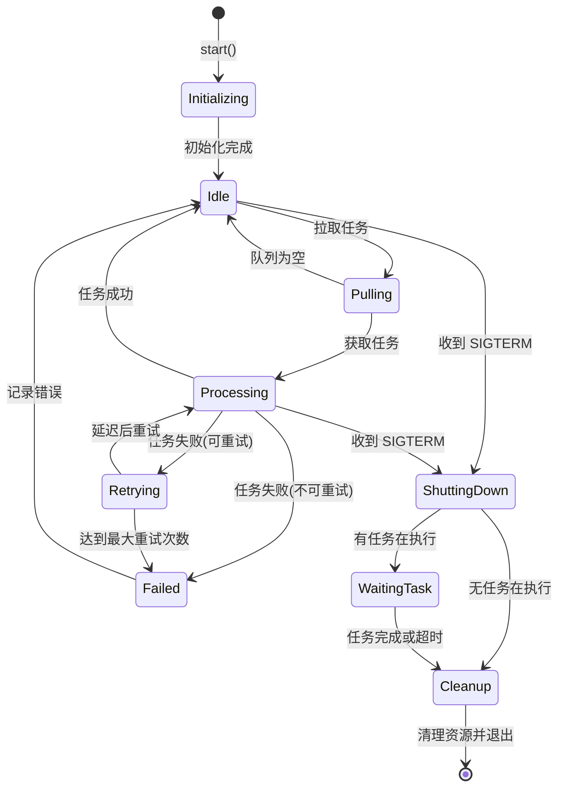

# 消息队列与 Worker 改进建议

## 概述

本文档记录了消息队列和 Worker 模块的已知问题和改进建议，用于指导未来的优化工作。

## 已识别的改进点

### 1. 增强错误和重试机制

**当前实现**: Worker 执行任务失败后直接标记为 FAILED，无重试机制。

**改进方案**:

#### 方案 A: Worker 级别重试
```python
class TaskWorker:
    def __init__(
        self,
        queue_manager: QueueManager,
        pipeline_service: PipelineService,
        max_retries: int = 3,
        retry_delay: int = 60,  # 秒
    ):
        self.max_retries = max_retries
        self.retry_delay = retry_delay
    
    def _process_task(self, task_id: str, task_data: dict):
        """处理任务(带重试)"""
        retry_count = 0
        last_error = None
        
        while retry_count <= self.max_retries:
            try:
                # 执行管线
                result = self.pipeline_service.process_meeting(...)
                self._update_task_state(task_id, TaskState.SUCCESS)
                return
            
            except Exception as e:
                last_error = e
                retry_count += 1
                
                if retry_count <= self.max_retries:
                    # 指数退避
                    delay = self.retry_delay * (2 ** (retry_count - 1))
                    logger.warning(
                        f"Task {task_id} failed (attempt {retry_count}/{self.max_retries}), "
                        f"retrying in {delay}s: {e}"
                    )
                    time.sleep(delay)
                else:
                    logger.error(f"Task {task_id} failed after {self.max_retries} retries: {e}")
        
        # 所有重试都失败
        self._update_task_state(task_id, TaskState.FAILED, error_message=str(last_error))
```

#### 方案 B: 队列级别重试 (RabbitMQ)
```python
class QueueManager:
    def _init_rabbitmq(self, rabbitmq_url: str):
        """初始化 RabbitMQ 客户端(带死信队列)"""
        import pika
        
        self.connection = pika.BlockingConnection(pika.URLParameters(rabbitmq_url))
        self.client = self.connection.channel()
        
        # 声明死信交换机
        self.client.exchange_declare(
            exchange='meeting_tasks_dlx',
            exchange_type='direct',
            durable=True
        )
        
        # 声明死信队列
        self.client.queue_declare(
            queue='meeting_tasks_dead_letter',
            durable=True
        )
        
        self.client.queue_bind(
            queue='meeting_tasks_dead_letter',
            exchange='meeting_tasks_dlx',
            routing_key='dead_letter'
        )
        
        # 声明主队列(带死信配置)
        self.client.queue_declare(
            queue=self.queue_name,
            durable=True,
            arguments={
                'x-dead-letter-exchange': 'meeting_tasks_dlx',
                'x-dead-letter-routing-key': 'dead_letter',
                'x-message-ttl': 3600000,  # 1 小时 TTL
            }
        )
```

**建议**: 
- MVP: 使用方案 A (简单，适用于 Redis 和 RabbitMQ)
- 生产: 如果使用 RabbitMQ，添加方案 B (死信队列)

**优先级**: 高 (影响可靠性)

---

### 2. 任务状态更新通知

**当前实现**: 状态更新仅写入数据库，无主动通知。

**改进方案**:

#### 方案 A: Webhook 通知
```python
class TaskWorker:
    def _update_task_state(
        self,
        task_id: str,
        state: TaskState,
        error_message: Optional[str] = None,
    ):
        """更新任务状态并发送通知"""
        # 1. 更新数据库
        with session_scope() as session:
            task_repo = TaskRepository(session)
            task = task_repo.update_state(
                task_id=task_id,
                state=state,
                error_message=error_message,
            )
        
        # 2. 发送 Webhook 通知
        if task.webhook_url:
            try:
                requests.post(
                    task.webhook_url,
                    json={
                        "task_id": task_id,
                        "state": state.value,
                        "timestamp": datetime.now().isoformat(),
                        "error": error_message,
                    },
                    timeout=5
                )
            except Exception as e:
                logger.warning(f"Failed to send webhook for task {task_id}: {e}")
```

#### 方案 B: Redis Pub/Sub
```python
class TaskWorker:
    def _update_task_state(self, task_id: str, state: TaskState, ...):
        """更新任务状态并发布事件"""
        # 1. 更新数据库
        ...
        
        # 2. 发布到 Redis
        redis_client.publish(
            f"task_updates:{task_id}",
            json.dumps({
                "task_id": task_id,
                "state": state.value,
                "timestamp": datetime.now().isoformat(),
            })
        )
```

**建议**: 
- Phase 1: 方案 B (Redis Pub/Sub，前端可订阅)
- Phase 2: 方案 A (Webhook，支持第三方集成)

**优先级**: 中 (提升用户体验)

---

### 3. 统一配置管理

**当前实现**: 配置硬编码在代码中。

**改进方案**:

```python
# src/queue/config.py
from pydantic import BaseModel, Field
from typing import Optional

class QueueConfig(BaseModel):
    """队列配置"""
    backend: str = Field(default="redis", description="队列后端: redis 或 rabbitmq")
    redis_url: str = Field(default="redis://localhost:6379/0")
    rabbitmq_url: Optional[str] = Field(default=None)
    queue_name: str = Field(default="meeting_tasks")
    max_retries: int = Field(default=3, description="最大重试次数")
    retry_delay: int = Field(default=60, description="重试延迟(秒)")
    
    class Config:
        env_prefix = "QUEUE_"  # 支持环境变量覆盖

class WorkerConfig(BaseModel):
    """Worker 配置"""
    max_shutdown_wait: int = Field(default=300, description="最大停机等待时间(秒)")
    heartbeat_interval: int = Field(default=30, description="心跳间隔(秒)")
    pull_timeout: int = Field(default=1, description="拉取超时(秒)")
    
    class Config:
        env_prefix = "WORKER_"

# 使用
from src.queue.config import QueueConfig, WorkerConfig

queue_config = QueueConfig()  # 自动从环境变量加载
worker_config = WorkerConfig()

queue_manager = QueueManager(
    backend=queue_config.backend,
    redis_url=queue_config.redis_url,
    queue_name=queue_config.queue_name,
)
```

**建议**: 立即实施 (提高可维护性)

**优先级**: 高

---

### 4. 扩展 Worker 功能

#### 4.1 任务分组/路由

**场景**: 不同类型的会议使用不同的队列或 Worker。

```python
class QueueManager:
    def push(
        self,
        task_id: str,
        task_data: Dict[str, Any],
        priority: int = 0,
        routing_key: Optional[str] = None,  # 新增
    ) -> bool:
        """推送任务到队列"""
        # 根据 routing_key 选择队列
        queue_name = self._get_queue_name(routing_key)
        
        if self.backend == QueueBackend.REDIS:
            self.client.zadd(queue_name, {message_json: -priority})
        elif self.backend == QueueBackend.RABBITMQ:
            self.client.basic_publish(
                exchange="",
                routing_key=queue_name,
                body=message_json,
                properties=pika.BasicProperties(priority=priority)
            )
    
    def _get_queue_name(self, routing_key: Optional[str]) -> str:
        """根据路由键获取队列名称"""
        if routing_key:
            return f"{self.queue_name}_{routing_key}"
        return self.queue_name

# 使用
queue.push(
    task_id="task_123",
    task_data={"meeting_type": "weekly_sync"},
    routing_key="weekly_sync"  # 路由到专用队列
)
```

**建议**: Phase 2 实施 (当任务类型多样化时)

**优先级**: 低

#### 4.2 定时任务

**场景**: 定期清理过期任务、生成报表等。

```python
# 使用 APScheduler
from apscheduler.schedulers.background import BackgroundScheduler

class TaskWorker:
    def __init__(self, ...):
        ...
        self.scheduler = BackgroundScheduler()
    
    def start(self):
        """启动 Worker 和定时任务"""
        # 添加定时任务
        self.scheduler.add_job(
            self._cleanup_expired_tasks,
            'interval',
            hours=1,
            id='cleanup_tasks'
        )
        self.scheduler.start()
        
        # 启动主循环
        super().start()
    
    def _cleanup_expired_tasks(self):
        """清理过期任务"""
        logger.info("Running scheduled task: cleanup_expired_tasks")
        # 实现清理逻辑
```

**建议**: Phase 2 实施 (非核心功能)

**优先级**: 低

---

### 5. 添加心跳监测

**目的**: 监控 Worker 健康状态。

```python
class TaskWorker:
    def __init__(self, ..., heartbeat_interval: int = 30):
        ...
        self.heartbeat_interval = heartbeat_interval
        self.worker_id = f"worker_{uuid.uuid4().hex[:8]}"
        self.last_heartbeat = None
    
    def start(self):
        """启动 Worker 主循环"""
        logger.info(f"Starting TaskWorker {self.worker_id}...")
        self.running = True
        
        # 启动心跳线程
        heartbeat_thread = threading.Thread(target=self._heartbeat_loop, daemon=True)
        heartbeat_thread.start()
        
        # 主循环
        while self.running:
            ...
    
    def _heartbeat_loop(self):
        """心跳循环"""
        while self.running:
            try:
                self._send_heartbeat()
                time.sleep(self.heartbeat_interval)
            except Exception as e:
                logger.error(f"Heartbeat failed: {e}")
    
    def _send_heartbeat(self):
        """发送心跳"""
        self.last_heartbeat = datetime.now()
        
        # 方案 A: 写入 Redis
        redis_client.setex(
            f"worker_heartbeat:{self.worker_id}",
            self.heartbeat_interval * 2,  # TTL 是心跳间隔的 2 倍
            json.dumps({
                "worker_id": self.worker_id,
                "timestamp": self.last_heartbeat.isoformat(),
                "current_task": self.current_task_id,
                "status": "running" if self.running else "stopping"
            })
        )
        
        # 方案 B: 写入数据库
        with session_scope() as session:
            session.execute(
                """
                INSERT INTO worker_heartbeats (worker_id, last_seen, current_task)
                VALUES (:worker_id, :last_seen, :current_task)
                ON CONFLICT (worker_id) DO UPDATE
                SET last_seen = :last_seen, current_task = :current_task
                """,
                {
                    "worker_id": self.worker_id,
                    "last_seen": self.last_heartbeat,
                    "current_task": self.current_task_id
                }
            )
```

**监控脚本**:
```python
# scripts/monitor_workers.py
def check_worker_health():
    """检查 Worker 健康状态"""
    redis_client = redis.from_url("redis://localhost:6379/0")
    
    # 获取所有 Worker 心跳
    keys = redis_client.keys("worker_heartbeat:*")
    
    for key in keys:
        data = json.loads(redis_client.get(key))
        worker_id = data["worker_id"]
        last_seen = datetime.fromisoformat(data["timestamp"])
        age = (datetime.now() - last_seen).total_seconds()
        
        if age > 60:  # 超过 1 分钟未心跳
            print(f"⚠️  Worker {worker_id} is unhealthy (last seen {age}s ago)")
        else:
            print(f"✅ Worker {worker_id} is healthy")
```

**建议**: Phase 1 实施 (重要的运维功能)

**优先级**: 高

---

### 6. 优化性能

#### 6.1 批量拉取 (Redis)

**当前实现**: 每次拉取一个任务。

**改进方案**:
```python
class QueueManager:
    def pull_batch(self, batch_size: int = 10, timeout: int = 1) -> List[Dict[str, Any]]:
        """批量拉取任务"""
        if self.backend == QueueBackend.REDIS:
            # 使用 ZRANGE 获取多个任务
            messages = self.client.zrange(
                self.queue_name,
                0,
                batch_size - 1,
                withscores=True
            )
            
            if messages:
                # 删除已拉取的任务
                self.client.zremrangebyrank(self.queue_name, 0, len(messages) - 1)
                
                return [json.loads(msg[0]) for msg in messages]
        
        return []
```

**权衡**:
- 优点: 提高吞吐量
- 缺点: 增加复杂度，需要并发处理

**建议**: Phase 2 实施 (当吞吐量成为瓶颈时)

**优先级**: 低

#### 6.2 动态超时

**当前实现**: 固定 1 秒超时。

**改进方案**:
```python
class TaskWorker:
    def _calculate_pull_timeout(self) -> int:
        """根据队列长度动态计算超时"""
        queue_length = self.queue_manager.get_queue_length()
        
        if queue_length > 100:
            return 0  # 队列积压，立即拉取
        elif queue_length > 10:
            return 1  # 正常负载
        else:
            return 5  # 空闲，减少 CPU 使用
    
    def start(self):
        """启动 Worker 主循环"""
        while self.running:
            timeout = self._calculate_pull_timeout()
            message = self.queue_manager.pull(timeout=timeout)
            ...
```

**建议**: Phase 2 实施 (优化资源使用)

**优先级**: 低

---

### 7. 高可用配置

#### Redis Sentinel 配置示例

```yaml
# config/production.yaml
queue:
  backend: redis
  redis_sentinels:
    - host: sentinel1.example.com
      port: 26379
    - host: sentinel2.example.com
      port: 26379
    - host: sentinel3.example.com
      port: 26379
  redis_master_name: mymaster
  redis_password: ${REDIS_PASSWORD}
  redis_db: 0
```

```python
# src/queue/manager.py
def _init_redis_sentinel(self, config: dict):
    """初始化 Redis Sentinel 客户端"""
    from redis.sentinel import Sentinel
    
    sentinel = Sentinel(
        [(s['host'], s['port']) for s in config['redis_sentinels']],
        socket_timeout=0.1
    )
    
    self.client = sentinel.master_for(
        config['redis_master_name'],
        socket_timeout=0.1,
        password=config.get('redis_password'),
        db=config.get('redis_db', 0),
        decode_responses=True
    )
```

#### Redis Cluster 配置示例

```python
def _init_redis_cluster(self, startup_nodes: List[dict]):
    """初始化 Redis Cluster 客户端"""
    from rediscluster import RedisCluster
    
    self.client = RedisCluster(
        startup_nodes=startup_nodes,
        decode_responses=True,
        skip_full_coverage_check=True
    )
```

**建议**: 在生产部署文档中添加配置示例

**优先级**: 中

---

### 8. 测试和监控扩展

#### 8.1 集成测试

```python
# tests/integration/test_queue_worker.py
import pytest
from unittest.mock import Mock
from src.queue.manager import QueueManager, QueueBackend
from src.queue.worker import TaskWorker

@pytest.fixture
def mock_redis(mocker):
    """Mock Redis 客户端"""
    mock_client = mocker.Mock()
    mocker.patch('redis.from_url', return_value=mock_client)
    return mock_client

def test_task_processing_flow(mock_redis):
    """测试任务处理流程"""
    # 1. 创建队列管理器
    queue = QueueManager(backend=QueueBackend.REDIS)
    
    # 2. 推送任务
    task_id = "test_task_001"
    task_data = {"audio_files": ["test.wav"]}
    queue.push(task_id, task_data)
    
    # 3. 验证 Redis 调用
    mock_redis.zadd.assert_called_once()
    
    # 4. 拉取任务
    mock_redis.bzpopmin.return_value = (
        "meeting_tasks",
        '{"task_id": "test_task_001", "data": {"audio_files": ["test.wav"]}}',
        0
    )
    
    message = queue.pull()
    assert message["task_id"] == task_id
```

**建议**: 立即添加 (保证代码质量)

**优先级**: 高

#### 8.2 Prometheus 指标

```python
# src/queue/metrics.py
from prometheus_client import Counter, Histogram, Gauge

# 定义指标
tasks_processed_total = Counter(
    'tasks_processed_total',
    'Total number of tasks processed',
    ['status']  # success, failed
)

task_processing_duration = Histogram(
    'task_processing_duration_seconds',
    'Task processing duration in seconds'
)

queue_length = Gauge(
    'queue_length',
    'Current queue length'
)

active_workers = Gauge(
    'active_workers',
    'Number of active workers'
)

# 在 Worker 中使用
class TaskWorker:
    def _process_task(self, task_id: str, task_data: dict):
        """处理任务(带指标)"""
        start_time = time.time()
        
        try:
            result = self.pipeline_service.process_meeting(...)
            tasks_processed_total.labels(status='success').inc()
        except Exception as e:
            tasks_processed_total.labels(status='failed').inc()
            raise
        finally:
            duration = time.time() - start_time
            task_processing_duration.observe(duration)
    
    def _heartbeat_loop(self):
        """心跳循环(更新指标)"""
        while self.running:
            # 更新队列长度
            queue_length.set(self.queue_manager.get_queue_length())
            
            # 更新活跃 Worker 数
            active_workers.inc()
            
            time.sleep(self.heartbeat_interval)
```

**暴露指标端点**:
```python
# main.py 或 worker.py
from prometheus_client import start_http_server

# 启动 Prometheus HTTP 服务器
start_http_server(8001)  # 指标暴露在 http://localhost:8001/metrics
```

**建议**: Phase 1 实施 (重要的监控功能)

**优先级**: 高

---

### 9. 文档增强

#### 9.1 Worker 生命周期 UML 图



#### 9.2 Redis vs RabbitMQ 对比表

| 特性 | Redis | RabbitMQ | 建议 |
|------|-------|----------|------|
| **部署复杂度** | 低 (单进程) | 中 (需要 Erlang) | Redis 适合快速启动 |
| **性能** | 极高 (内存操作) | 高 (磁盘持久化) | Redis 更快 |
| **持久化** | AOF/RDB (可选) | 内置持久化 | RabbitMQ 更可靠 |
| **优先级队列** | 需手动实现 (sorted set) | 原生支持 | RabbitMQ 更简单 |
| **死信队列** | 需手动实现 | 原生支持 | RabbitMQ 更完善 |
| **消息确认** | 手动管理 | 自动 ACK/NACK | RabbitMQ 更安全 |
| **集群支持** | Sentinel/Cluster | 原生集群 | 都支持高可用 |
| **监控工具** | Redis CLI, RedisInsight | Management UI | RabbitMQ 更友好 |
| **学习曲线** | 低 | 中 | Redis 更易上手 |
| **适用场景** | 简单队列、高性能 | 复杂路由、可靠性 | 根据需求选择 |

**建议**:
- **开发/测试**: 使用 Redis (简单、快速)
- **生产环境**: 
  - 任务简单、性能优先 → Redis Cluster
  - 任务复杂、可靠性优先 → RabbitMQ

#### 9.3 异步推送示例

```python
# src/api/routes/tasks.py (异步版本)
@router.post("", response_model=CreateTaskResponse, status_code=201)
async def create_task(
    request: CreateTaskRequest,
    user_id: str = Depends(verify_api_key),
    tenant_id: str = Depends(get_tenant_id),
    db: Session = Depends(get_db),
    queue: QueueManager = Depends(get_queue_manager),
):
    """创建任务(异步版本)"""
    # ... 创建任务记录 ...
    
    # 异步推送到队列
    import asyncio
    loop = asyncio.get_event_loop()
    await loop.run_in_executor(
        None,
        queue.push,
        task_id,
        task_data,
        0
    )
    
    return CreateTaskResponse(...)
```

**注意**: 当前 QueueManager 是同步的，如需真正异步需要使用 `aioredis` 或 `aio-pika`。

---

## 实施优先级总结

### 高优先级 (立即实施)
1. ✅ 统一配置管理 (Pydantic)
2. ✅ 心跳监测
3. ✅ Prometheus 指标
4. ✅ 集成测试
5. ✅ 错误重试机制

### 中优先级 (Phase 1)
6. 任务状态通知 (Redis Pub/Sub)
7. 高可用配置文档
8. 文档增强 (UML 图、对比表)

### 低优先级 (Phase 2)
9. 任务分组/路由
10. 定时任务
11. 批量拉取
12. 动态超时
13. RabbitMQ 死信队列

## 技术债务清单

- [ ] 实施配置管理 (Pydantic)
- [ ] 添加 Worker 心跳监测
- [ ] 集成 Prometheus 指标
- [ ] 编写集成测试
- [ ] 实现任务重试机制
- [ ] 添加 Redis Pub/Sub 通知
- [ ] 完善高可用配置文档
- [ ] 添加 UML 图和对比表
- [ ] 考虑异步队列客户端 (aioredis)

## 参考资源

- [Celery Documentation](https://docs.celeryproject.org/) - 成熟的分布式任务队列
- [RQ (Redis Queue)](https://python-rq.org/) - 简单的 Redis 队列
- [Prometheus Python Client](https://github.com/prometheus/client_python)
- [APScheduler](https://apscheduler.readthedocs.io/) - Python 定时任务库

